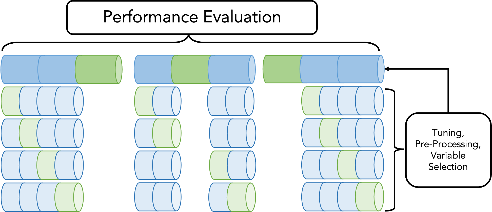

```{r setup, include=FALSE}
library(papaja)
library(knitr)
library(data.table)
library(ggplot2)
library(mlr3verse)
library(mlr3viz)
library(ranger)
library(glmnet)
library(DALEX)
library(DALEXtra)
r_refs("r-references.bib")
my_citations <- cite_r(file = "r-references.bib")
```

```{r analysis-preferences, warning=FALSE, message=FALSE, include=FALSE}
# Seed for random number generation
set.seed(42)
knitr::opts_chunk$set(cache.extra = knitr::rand_seed)
knitr::opts_chunk$set(echo = TRUE, fig.align = "center", tidy = FALSE, comment = NA,
  message = FALSE, warning = FALSE, cache = FALSE, autodep = FALSE, eval = TRUE)
options(scipen = 1, digits = 2, ggplot2.discrete.colour = list(RColorBrewer::brewer.pal(2, "Dark2"), RColorBrewer::brewer.pal(10, "RdYlBu"), rep(RColorBrewer::brewer.pal(10, "RdYlBu"), 6)))
```

```{r, echo=FALSE}
# try to reduce mlr3 output (unfortunately this is not working correctly...)
lgr::get_logger("mlr3")$set_threshold("warn")
lgr::get_logger("bbotk")$set_threshold("warn")
```

# Outline and Purpose of this Document

This document contains additional explanations, visualizations, and practical demonstrations of supervised machine learning (ML) concepts we could not include in the main manuscript for space constraints.

If you want to perform the showcased analyses yourself without copying the R code from the PDF, you can use the corresponding *electronic_supplemental_material.Rmd* document, which is available in our *OSF repository* at <https://osf.io/9273g/>.
We assume that readers are generally familiar with data analysis in R.
To follow our demonstrations, please install R ^[https://cran.r-project.org/. We used `r R.version.string`.] and download our materials from the OSF repository.
If you open the *mlr3TutorialPaper.Rproj* file with the RStudio IDE ^[https://posit.co/download/rstudio-desktop/], you can follow the displayed instructions to automatically install all R packages to a local *renv* project library with the exact versions we used in this tutorial.
All sections in this document are referred to in the main manuscript by section number for more context.
For convenience, this document is set up in a way that it should be possible (with few exceptions) to run the R code from each section without having to run code from previous sections.

For the demonstrations in this document, we will use simulated data, *AmesHousing* data, *Titanic* data, and the *PhoneStudy* dataset.^[We use the AmesHousing dataset included in the *AmesHousing* R package [@ameshousing_2020] and the Titanic dataset included in the *rpart.plot* R package [@rpartplot_2021].]
Throughout the document, we use the following versions for R and its packages:
`r my_citations`

\newpage

# Basic Machine Learning and Programming Concepts

## Visualization of Regression and Classification Models

(ref:regr-classif-caption) Visualization of regression and classification models. Left: linear regression model trained on reduced AmesHousing regression. Right: logistic regression model trained on reduced Titanic classification task.

```{r regr-classif, echo=FALSE, fig.cap="(ref:regr-classif-caption)", out.width="\\linewidth", fig.height=4, fig.width=9, message=FALSE, results='hide'}

library(rpart.plot)
library(AmesHousing)
library(ggplot2)
library(patchwork)
library(mlr3verse)
library(mlr3viz)

data(ptitanic)
ptitanic <- na.omit(ptitanic)

ames <- make_ames()
ames <- ames[ames$Sale_Price < 700000 & ames$Gr_Liv_Area < 4000, 
  c("Gr_Liv_Area", "Year_Built", "Sale_Price")]

## reduce data set for better visibility
set.seed(589)
select <- sample(1:nrow(ames), 0.10*nrow(ames)) #take only 10% of the sample for this didactic example
ames <- ames[select,]

ames$Year_Built <- as.numeric(ames$Year_Built)
ames$Gr_Liv_Area <- as.numeric(ames$Gr_Liv_Area)
ames$Sale_Price <- ames$Sale_Price / 1000 # new unit: 1000 dollars
task_ames <- as_task_regr(ames, id = "Ames Housing", target = "Sale_Price")

ptitanic$parch <- as.numeric(ptitanic$parch)
task_titanic <- TaskClassif$new(id = "Titanic", backend = ptitanic, 
  target = "survived", positive = "survived")$select(c("age", "parch"))

lm <- lrn("regr.lm")
logr <- lrn("classif.log_reg", predict_type = "prob")

(plot_learner_prediction(learner = lm, task = task_ames) + ggtitle("AmesHousing") + scale_fill_viridis_c(option = "turbo")) + 
  (plot_learner_prediction(learner = logr, task = task_titanic) + ggtitle("Titanic"))


```

In Figure \@ref(fig:regr-classif) we visualize some predictions for two exemplary data sets, we use throughout our tutorial.
The left figure shows the predictions of a linear regression model trained on the *Bosting Housing* dataset.
In this reduced version, the sales price (unit 1000 dollars) of properties in Ames, Iowa between 2006 and 2010 is predicted based on two features: *Gr_Liv_Area* (above ground living area in square feet) and *Year_Built* (the original construction date).
The sale price is a continuous variable, thus AmesHousing is considered a *regression task*.
The color of points displays the observed price, while the background color show the price predictions by the linear regression model for each combination of feature values.

The right figure shows the predictions of a logistic regression model trained on the *Titanic* dataset.
In this reduced version, it is predicted whether a passenger survived the Titanic disaster based on the two features *age* (the age of the passenger) and *parch* (the number of parents and children traveling with the passenger).
The survival of a passenger is a (binary) categorical variable, thus Titanic is considered a *classification task*.
The color of points displays whether the passenger actually survived, while the background color shows the probability for survival predicted by the logistic regression model for each combination of feature values.

## Comments on R6: Potential Pitfalls and How to Effectively Search the mlr3 Documentation


The packages from the *mlr3verse* are written in the **R6** object-oriented programming system for R.
For a short introduction on the most important implications of this design choice for the average R user, see the mlr3 ebook at <https://mlr3book.mlr-org.com/>.

### Potential Pitfalls

Apart from some unfamiliar syntax, the only aspect which could lead to potentially dangerous, unintended behavior is that **R6 objects are NOT copied when modified**.
Here we show what that means:

We create a learner, assign it to the object `lrn1` and then assign `lrn1` again to the object `lrn2`.
If we now change the id of `lrn2`, this will **also** change the id of `lrn1` because both objects internally point to the **same** learner.

```{r}
lrn1 <- lrn("regr.lm")
lrn2 <- lrn1
lrn2$id <- "LEARNER 2"
lrn1$id
```

If we want to copy and separate an R6 object (like `lrn1` from this example), we have to use the `$clone(deep = TRUE)` method:

```{r}
lrn1 <- lrn("regr.lm")
lrn2 <- lrn1$clone(deep = TRUE)
lrn2$id <- "LEARNER 2"
lrn1$id
```

Another safe user workflow is to avoid copying mlr3 objects and simply create new objects with the same properties (e.g., use the `lrn` function a second time to create `lrn2`).

### Effective Search in the mlr3 Documentation

An inconvenient consequence of the design choice to use **R6** is that using the R `help` function `?` to look up information from the extensive mlr3 documentation is less intuitive for users unfamiliar with R6. We want to give some useful tips here:

- If you want to use advanced functionality of mlr3 not covered in the tutorial for which you have to make extended use of the mlr3 documentation, we recommend to first read the quick *R6 for beginners* section in the mlr3 e-book (<https://mlr3book.mlr-org.com/>).
- Many common functions we use in the tutorial (e.g., `lrn`, `rsmp`, `msr`) are actually convenience functions (also called *syntactic sugar*) for the extensive underlying functions written in R6. If you want to look up information on how to use these functions, you have to find the R help page on the underlying R6 function. For example, if you type `?lrn` in the R console this will first bring up the help page on all of mlr3's syntactic sugar functions. If you then click on *Learner* next to `lrn()` on the help page, this will bring you to the help page of the *Learner* R6 class. There you will find all information including examples on how to construct a learner object to be used in mlr3.
- Most objects in mlr3 (e.g. learners, resampling descriptions, performance measures) can lead you to their respective help page by using `$help()`. For example, if you have created a random forest learner like we do in the second exercise `rf <- lrn("regr.ranger")`, typing `rf$help()` will open the associated help page.
- In mlr3 many functions belong to a certain R6 class. You can find the classes an R object belongs to by using the `class` function (e.g. `class(rf)`). For example, the `predict` function is not a separate function in mlr3 but is a *Method* that belongs to the *Learner* class. This can be seen in the first exercise of the tutorial, where the syntax to use the trained learner object named `lm` to predict the observations in the task object named `task_Soci` is `lm$predict(task = task_Soci)`. If you want to find the documentation on how to use `predict`, you will find this information on the help page of the *Learner* class to which `predict` is a *Method*. Thus to find help, you either have to already know how the class is called in mlr3 (here you could type `?Learner` in the R console to get to the help page) or you have to know how to create an object from this class (here you could type `?lrn` in the R console and then maneuver in the documentation to the respective class page).
- In mlr3 many objects from a certain R6 class have *Fields* and *Bindings* that contain useful information. For example, for each task object (e.g. `task_Soci` which we create in the first exercise) we can extract the name of its target variable with the syntax `task_Soci$target_names`. If you want to find the documentation on the `target_names` binding, you will find this information on the help page of the *Task* class. Thus to find help, you either have to know how the class is called in mlr3 (here you would type `?Task` in the R console to get to the help page) or you have to know how to create an object from this class (here you would type `?as_task_regr` in the R console and then maneuver in the documentation to the respective class page).

## Simple Metaphor of the Bias - Variance Tradeoff

(ref:dart-caption) Hits on a target display for visualizing the bias-variance trade-off in ML.

```{r dart, echo=FALSE, warning=FALSE, fig.cap="(ref:dart-caption)", fig.align='center', out.width="60%"}
knitr::include_graphics("Figures/targets.png")
```

The bias-variance trade-off is sometimes visualized with hits on a target display as showcased in Figure \@ref(fig:dart) [see also @yarkoni_choosing_2017]. 
While intuitive on first sight, this metaphor also has its weaknesses. But as it is useful for illustration purposes, we adopt it here. 
The metaphor is accurate if we imagine the middle of the bulls-eye as the true value (expected target value for a certain fixed combination of feature values).
Each display shows predictions from a concrete ML model.
Each point in a display is the prediction made by the concrete model, when trained on a randomly drawn training set, all from the same population and the same sample size.

With high bias (top row), the average prediction (across different samples) lies far away from the true expected value. 
With high variance (right column), the same combination of feature values produces dissimilar predictions (across different samples).
In the case of low bias and low variance (bottom left), the only reason why predictions (across different samples) are not similar is the irreducible noise inherent in the concrete prediction problem.
An optimal predictive model should have low bias **and** low variance for the concrete data setting at hand (e.g., sample size, functional relationship, number of features, ...).
More in-depth visualizations and explanations of the bias-variance tradeoff of predictive performance are given in our main text.

# Advanced Topics in Performance Evaluation

## Visualization of Negative $R^2$

(ref:negative-rsq-caption) Demonstration of negative out-of-sample $R^2$.

```{r negative-rsq, fig.cap="(ref:negative-rsq-caption)", echo=FALSE, out.width="\\linewidth", fig.width=7, fig.height=4}
library(mvtnorm)
library(gridExtra)

mu <- c(0,0)
cov1 <- matrix(c(1,0.3,0.3,1),2)
ntrain <- 10
ntest <- 10
n <- 20

set.seed(6, sample.kind = "Rounding")
data <- rmvnorm(n, mean = mu, sigma = cov1)
colnames(data) <- c("x", "y")
data <- data.frame(data)

train <- sample(1:20, 10)
test <- setdiff(1:20, train)

negR2task <- TaskRegr$new("y", backend = data, target = "y")
easylearn <- lrn("regr.lm")
easylearn$train(negR2task, row_ids = train)

predtrain <- easylearn$predict(negR2task, row_ids = train)
predtest <- easylearn$predict(negR2task, row_ids = test)

perf_train <- predtrain$score(msr("regr.rsq"))
perf_test <- predtest$score(msr("regr.rsq"))

p1 <- ggplot(data = data[train,], aes(x = x, y = y)) + 
  geom_point(color = RColorBrewer::brewer.pal(2, "Dark2")[1]) +
  geom_smooth(method = "lm", se = FALSE, fullrange = TRUE, color = RColorBrewer::brewer.pal(2, "Dark2")[1]) +
  theme_bw() + theme(legend.position="none") +
  xlim(-2,2) + ylim(-2,3) +
  annotate("text", x = 0, y = 3, label = paste0("italic(R)[train]^2 ==", perf_train),
    parse = TRUE, color = RColorBrewer::brewer.pal(2, "Dark2")[1], size = 5)

p2 <- ggplot(data = data[train,], aes(x = x, y = y)) + 
  geom_smooth(method = "lm", se = FALSE, fullrange = TRUE, color = RColorBrewer::brewer.pal(2, "Dark2")[1]) +
  theme_bw() + theme(legend.position="none") +
  geom_point(data = data[test,], aes(x = x, y = y),
    color = RColorBrewer::brewer.pal(2, "Dark2")[2], shape = 4) +
  xlim(-2,2) + ylim(-2,3) +
  annotate("text", x = 0, y = 3, label = paste0("italic(R)[test]^2 ==", perf_test),
    parse = TRUE, color = RColorBrewer::brewer.pal(2, "Dark2")[2], size = 5)

p3 <- ggplot(data = data[train,], aes(x = x, y = y)) + 
  geom_point(color = RColorBrewer::brewer.pal(2, "Dark2")[1]) +
  geom_smooth(method = "lm", se = FALSE, fullrange = TRUE, color = RColorBrewer::brewer.pal(2, "Dark2")[1]) +
  theme_bw() + theme(legend.position="none") +
  geom_point(data = data[test,], aes(x = x, y = y),
    color = RColorBrewer::brewer.pal(2, "Dark2")[2],
    shape = 4) +
  geom_smooth(data = data[test,], aes(y = y, x = x), method = "lm", 
    formula = y ~ x, color = RColorBrewer::brewer.pal(2, "Dark2")[2], 
    linetype = 3, se = FALSE, fullrange = TRUE) +
  xlim(-2,2) + ylim(-2,3)

grid.arrange(p1, p2, p3, ncol = 3)
```

Figure \@ref(fig:negative-rsq) demonstrates how negative values of $R^2$ can arise in predictive modeling.
On the left, we see a model fitted to training data with a positive $R_{train}^2$.
In the middle, we see the trained model along with test data, which was simulated from the same population as the training data.
Evaluating model predictions of these independent test data reveals a negative $R_{test}^2$.
On the right, we see that -- by chance -- the underlying relationship is positive in the test sample (see the dotted regression line which would result if the model were trained on the test data), although both samples were actually drawn from a population with a negative relationship.
The risk of obtaining a negative $R^2_{test}$ increases with smaller samples sizes (of both training and test data), higher numbers of features, or more flexible models with a greater tendency to overfit.

## Theory and Application of Nested Resampling

(ref:NestedResampling-caption) Scheme for visualizing the principle behind nested cross-validation (with 3 outer folds and 4 inner folds).

```{r NestedResampling, echo=FALSE, warning=FALSE, fig.cap="(ref:NestedResampling-caption)", fig.align='center', out.width="100%"}

```

If model decisions require resampling (e.g., hyperparameter tuning), correctly estimating the predictive performance of such a model strategy requires nested resampling loops.
Such a nested resampling process is demonstrated in Figure \@ref(fig:NestedResampling).
In our example, we are interested in training a random forest model on the Titanic dataset, while tuning the *mtry* (the number of features to consider at each split) and *min.node.size* (the minimum number of observations within a node to continue splitting) hyperparameters with 4-fold cross-validation (CV).
For each of the 4 training sets, we randomly draw 100 combinations of *mtry* (integer values between 1 and 5) and *min.node.size* (integer values between 1 and 50) and fit the random forest model with each hyperparameter combination.
We determine the best performing parameter combination among the 100 candidate sets by comparing the average predictive performance across the 4 corresponding test sets.
Then, the random forest model is retrained on the combined training sets with the hyperparameter combination that achieved the lowest MMCE.

To estimate how the final model resulting from this tuning approach can be expected to work on new unseen data based on the MMCE, we use 3-fold CV.
Note that typically, we should use more extensive resampling for the performance estimation (e.g., 10-times repeated CV) compared to the hyperparameter tuning stage (e.g., 5 or 10-fold CV).
The only reason we deviate from this rule here is to simplify the visualization in Figure \@ref(fig:NestedResampling).
The top line depicts the 3 outer folds used for the performance evaluation.
In the first fold of this outer resampling loop, the complete Titanic dataset is divided into three random parts and the first two parts are used for model training.
In the inner resampling loop used for hyperparameter tuning, this outer training set is again divided into 4 different parts.
This inner CV loop performs the same tuning steps described above for the final model applied in practice, with the only difference that now only 2/3 of the observations (i.e., the first training set of the outer resampling loop) from the complete Titanic dataset are used.
When the best performing hyperparameter combination has been identified in the inner CV loop, the random forest model is retrained with these hyperparameter values on the complete first outer training set and the performance is evaluated on the first outer test set.
Then the whole procedure is repeated for the second and third outer training sets.
In the last step, MMCE estimates of the three outer test sets are averaged to compute the final performance estimate.

Now we show how to compute the above example with mlr3:
For this advanced example, we do not perform a complete case analysis (like we did for the Titanic examples in the main manuscript) but keep missing feature values within the task.
```{r, message = FALSE}
# load the packages
library(rpart.plot)
library(mlr3verse)
library(paradox)
library(future)

# create titanic task
data(ptitanic)
titanic <- ptitanic
titanic$age <- as.numeric(titanic$age)
titanic$sibsp <- as.numeric(titanic$sibsp)
titanic$parch <- as.numeric(titanic$parch)
task_titanic <- as_task_classif(titanic, id = "Titanic", 
  target = "survived", positive = "survived")
```

Then we build an analysis pipeline that first imputes missing feature values with the median and then applies a random forest model on the imputed dataset.
```{r}
# create learner/analysis pipeline
imputer <- po("imputemedian")
rf <- lrn("classif.ranger", num.trees = 500)
pipeline <- imputer %>>% rf
```

Because we want to tune some hyperparameters of the random forest model in the pipeline, we place our pipeline into an *AutoTuner* object.
An *AutoTuner* behaves like a normal mlr3 learner that automatically tunes hyperparameters as specified when trained on some data.
When creating the *AutoTuner* we have to define which hyperparameters shall be tuned (here *mtry* and *min.node.size*), which resampling strategy (here 4-fold CV), and which performance measure (here $ACC$) should be used for tuning.
We also specify how many hyperparameter values are compared (here we randomly draw 100 hyperparameter combinations).
Note that when we put our random forest learner into a pipeline, the names of hyperparameters were extended (to make them unique in case the same hyperparameter appears in a pipeline more than once).
The extended names of all hyperparameters in the pipeline can be checked with `pipeline$param_set`.
```{r}
# define tuning
pipeline_ps <- ParamSet$new(list(
  ParamInt$new("classif.ranger.mtry", lower = 1, upper = 5),
  ParamInt$new("classif.ranger.min.node.size", lower = 1, upper = 50)
  ))
res_inner <- rsmp("cv", folds = 4)
mes_inner <- msr("classif.acc")
terminator <- trm("evals", n_evals = 100)
tuner <- tnr("random_search")

# create Graphlearner that performs tuning automatically
pipeline_at <- AutoTuner$new(
  learner = pipeline,
  resampling = res_inner,
  measure = mes_inner,
  search_space = pipeline_ps,
  terminator = terminator,
  tuner = tuner
)
```

Next, we use 3-fold CV to estimate the predictive performance of the *AutoTuner*. 
```{r}
# evaluate predictive performance
plan("multisession", workers = 2)
set.seed(2)
res_outer <- rsmp("cv", folds = 3)

invisible({capture.output({ # remove console output from pdf document
nested_res <- resample(
  task = task_titanic,
  learner = pipeline_at,
  resampling = res_outer
)
})})

plan("sequential")
```

Last, we use the $MMCE$ to average the estimated performance across the outer test sets.
```{r}
mes_outer <- msr("classif.ce")
nested_res$aggregate(mes_outer)
```

Note that it is possible that the best selected hyperparameter combination might differ for each outer training set.
Moreover, none of the outer training sets might use the exactly identical hyperparameter combination than the final model (which is computed by training the AutoTuner on the complete Titanic task).
This is no problem, because the only purpose of the nested resampling scheme is to estimate predictive performance and none of the models trained during this scheme will ever be applied in any practical application.
Only the final model (i.e., the full model) would be used to make predictions for new unseen observations in a practical application.


## Demonstration of Common Mistakes when Performing Variable Selection

The following simulation shows how common mistakes in model evaluation for modeling pipelines that include variable selection can easily produce incorrect and overly optimistic performance estimates.

*WARNING: This is a recipe for potential disaster!*

Simulate completely random data (same size of the data as the *PhoneStudy* dataset) and define an arbitrary target.

```{r}
# load the mlr3 packages
library(mlr3verse)
# load the data
phonedata <- readRDS(file = "../data/clusterdata.RDS")
phonedata <- phonedata[complete.cases(phonedata$gender),]
phonedata <- phonedata[, c(1:1821, 1837)]
```

```{r}
set.seed(1)
dat <- matrix(rnorm(prod(dim(phonedata))), nrow = nrow(phonedata), 
  ncol = ncol(phonedata))
dat <- as.data.frame(dat)
colnames(dat)[ncol(phonedata)] <- "Target"
```

Compute correlations of all features with the target.
Only retain the ten most correlated features when creating the prediction task object for mlr3.

```{r}
target_cors <- cor(dat)[-ncol(phonedata), "Target"]
ten_best_vars <- names(sort(abs(target_cors), decreasing = TRUE)[1:10])

task_10 <- as_task_regr(dat[,c(ten_best_vars, "Target")], id = "ten_best",
  target = "Target")
```

Let's fit a simple regression model using those top-ten "best" variables to predict the target values, using all observations from the complete dataset.

```{r}
lm <- lrn("regr.lm")
lm$train(task_10)
preds <- lm$predict(task_10)
preds$score(msr("regr.rsq"))
```

**Oh wow:** a positive $R^2$, although we know that there really is no relationship between the target and those variables.

Let's try to be more "sophisticated" by using some intense, repeated CV.

```{r}
rdesc <- rsmp("repeated_cv", folds = 10, repeats = 10)
res_overfit <- resample(lm, task = task_10, resampling = rdesc)
res_overfit$aggregate(msr("regr.rsq"))
```

**Amazing:** $R^2$ is still positive! This must be an important discovery!
But of course - unfortunately it is not! We just produced a much too optimistic performance estimate.
**What did we do wrong here?** To obtain a realistic estimate of the predictive performance of our model, the variable selection has to be integrated into the resampling process. Let's create a **GraphLearner** with a **Filter** that will choose the top-ten variables in each CV iteration (those can be different).

```{r}
filter <- flt("correlation", method = "pearson")
filter <- po("filter", filter = filter)
filter$param_set$values$filter.nfeat <- 10
filtered_lm <- as_learner(filter %>>% lm)
```

Run the resampling with the **GraphLearner** on the complete dataset, using all variables.

```{r}
task_1000 <- as_task_regr(dat, id = "all_vars", target = "Target")
res_nested <- resample(filtered_lm, task = task_1000, resampling = rdesc)
```

```{r}
res_nested$aggregate(msr("regr.rsq"))
```

**Result:** negative $R^2$... We did worse than a very simple model that would always predict the target mean of the respective test sets while ignoring all values on the features.

This example does not imply that variable selection automatically leads to models with bad predictive performance.
In fact, there are many predictive settings in which sophisticated variable selection improves predictive accuracy, and the ML literature discusses a variety different variable selection methods [e.g., @bommert_2020].
Our example only demonstrates that when performing variable selection, paying close attention to use the correct performance evaluation strategy is extremely important.

## Theory and Application of Blocked Resampling

In this section we want to showcase blocked resampling, a technique to produce unbiased performance estimates for clustered or hierarchical data (e.g., repeated measures).
The *PhoneStudy* dataset is in fact a collection of three independent studies conducted between 2014 and 2018 [@Stachl2020].
Let us assume that the relationship between personality and smartphone use changes over time.
If we would collect data for a new study and use the *Sociability* model trained on the PhoneStudy dataset to predict these new observations, the predictive performance would be lower than implied by our standard CV estimate.
With standard CV, corresponding training and test sets both contain observations from the same study, something which would not happen in the hypothetical application described above. 
In contrast, **blocked resampling** estimates the performance of using the model to make predictions for observations from a study not already included in the PhoneStudy dataset.

First we will load a separate data vector indicating which observation from the complete PhoneStudy dataset belonged to which of the three original studies.

```{r}
# load study ids
study_id <- readRDS(file = "../data/study_id.RDS")
table(study_id)
```

We again load the PhoneStudy dataset and attach the `study_id` vector to it before removing observations with missing target values.
The `study_id` vector has the same length as the number of rows in the full `phonedata` dataframe.
For each observation in `phonedata`, `study_id` indicates in which of the three original studies the respective person was recruited.
Make sure to load a fresh copy of the PhoneStudy dataset so that missing values can be removed **after** attaching `study_id`.
Otherwise, the study assignment will be wrong!

```{r}
# load the mlr3 packages
library(mlr3verse)
# load the PhoneStudy dataset
phonedata <- readRDS(file = "../data/clusterdata.RDS")
# add study id variable to the dataset
phonedata$study_id <- study_id
# remove some observations and variables
phonedata <- phonedata[complete.cases(phonedata$gender),]
phonedata <- phonedata[, c(1:1821, 1837, 1860)] # we exclude gender (1823) here
```

We again create the task object for predicting Sociability.
The only new thing is that we have to select *study_id* as a grouping variable and at the same time remove it from the feature set (to make sure that our model will not use *study_id* as a feature).  

```{r}
library(mlr3verse)
# create task
task_Soci <- as_task_regr(phonedata, id = "Sociability", 
  target = "E2.Sociableness")
# set study_id as grouping variable and
# remove study_id from the feature set
task_Soci$set_col_roles("study_id", add_to = "group", 
  remove_from = "feature")
```

In the next step, we create the familiar random forest learner we already used earlier in this tutorial.
We also have to define our resampling strategy.
Because our dataset consists of 3 independent samples, we will use 3-fold CV here which will automatically respect our grouping factor defined in the task.
As a result, observations from each of the three studies will always be predicted based on a model trained on the combined data from the two remaining studies.
If predicting observations from the same study is easier, the proxy models, which are part of our blocked CV, will not be able to use such an advantage.

```{r}
# define learner
imputer <- po("imputemedian")
rf <- lrn("regr.ranger")
rf <- as_learner(imputer %>>% rf)

# define resampling description
# use cross-validation with number of folds equal to number of studies 
rdesc <- rsmp("cv", folds = 3)
```

We can then perform the resampling and display the aggregated results.
As already mentioned, the resampling command will automatically make sure that the full set of observations with the same value in *study_id* will either be in the training or in the test set, but not in both.

```{r}
# perform resampling and compute performance estimate
set.seed(1)

invisible({capture.output({ # remove console output from pdf document
res <- resample(learner = rf, task = task_Soci, resampling = rdesc)
})})
```

```{r}
res$aggregate(c(msr("regr.rsq"), 
  msr("regr.rsq", id = "classif.rsq.sd", aggregator = sd)))
```

Note that the performance estimated by blocked resampling is comparable to the standard performance estimate for the PhoneStudy reported in our main manuscript.
This is also reassuring for our confidence in the extended results from the original PhoneStudy publication, which used repeated CV without blocking [@Stachl2020].

Note that CV assumes that each observation is part of exactly one test set.
Thus when using CV in this blocking example, no number of folds larger than three is possible (and mlr3 will throw some unintuitive error message if we try).
In many practical applications, the number of groups is much higher.
For example, for a dataset in which observations are nested within persons, the number of persons (i.e., the number of different values of the blocking variable) will typically be much higher than a reasonable number of CV folds, so blocking will not limit your choice of the number of CV folds.
If we wanted a more stable performance estimate than 3-fold CV for our PhoneStudy example (which would be more stable for different seeds), we could switch to another resampling strategy than CV [e.g., subsampling\; see `?mlr_resamplings_subsampling` or @bischl_resampling_2012]. 

In settings with more than one blocking variables (or complex combinations of blocking and stratification) mlr3 cannot construct the required folds automatically.
In such cases, the function `mlr_resamplings_custom` can be used to manually define the resampling indices (i.e., the *row_ids* of the task) for all training and test sets.
A more detailed tutorial on how to perform custom resampling in mlr3 can be found at <https://mlr-org.com/gallery/basic/2020-03-30-stratification-blocking/>.

## Demonstration of Repeated Cross-Validation and the Variability of Resampling Estimates

For the demonstration in this section, we ...

- use 3-times repeated 5-fold CV
- aggregate accuracy across test sets with the median
- quantify variability of test set performance with the interquartile range

First, we load the PhoneStudy dataset.

```{r}
# load the mlr3 packages
library(mlr3verse)
# load the data
phonedata <- readRDS(file = "../data/clusterdata.RDS")
phonedata <- phonedata[complete.cases(phonedata$gender),]
phonedata <- phonedata[, c(1:1821, 1837)] # we exclude gender (1823) here
```

For this exercise, we use the artificial binary classification task we introduced in the main text.
Note that we actually would not discretize a continuous target when performing predictive modeling in a real application or one of our research project.

```{r}
phonedata$E2.Sociableness_bin <- ifelse(
  phonedata$E2.Sociableness >= median(phonedata$E2.Sociableness),
  "high", "low")
phonedata$E2.Sociableness_bin <- 
  as.factor(phonedata$E2.Sociableness_bin)

task_Soci_bin <- as_task_classif(phonedata,
  id = "Sociability_Classif", target = "E2.Sociableness_bin", 
  positive = "high")
# remove the continuous Sociability variable from the feature set
task_Soci_bin$set_col_roles("E2.Sociableness", remove_from = "feature")
# stratum enables stratified resampling 
task_Soci_bin$set_col_roles("E2.Sociableness_bin", add_to = "stratum")
```

We create the familiar random forest GraphLearner that automatically performs median imputation.

```{r}
# create learner
imputer <- po("imputemedian")
rf <- lrn("classif.ranger", num.trees = 500)
rf <- as_learner(imputer %>>% rf)
```

We define our 3-times repeated CV scheme and perform the resampling.

```{r}
# perform resampling
rep_cv <- rsmp("repeated_cv", folds = 5, repeats = 3)
res <- resample(task_Soci_bin, learner = rf, resampling = rep_cv)
```

When computing the final performance estimate based on the classification accuracy, we here show how to use the `median` as aggregation function instead of the `mean`(which is the default setting).
We can also compute a measure for the variability of the final performance estimate by using the *interquartile range* to aggregate the performance estimates across test sets (common alternatives would be to use the *standard deviation* or *variance*).

```{r}
mes <- list(msr("classif.acc", id = "ACC (Md)", aggregator = median),
  msr("classif.acc", id = "ACC (IQR)", aggregator = IQR))
res$aggregate(mes)
```

One argument for choosing the *median* and the *interquartile range* over the *mean* and the *standard deviation* is a reduced vulnerability against performance outliers of some test sets.
Here, our main reason is that when using those aggregation functions, we can easily visualize the logic of repeated CV with boxplots (which use median and interquartile range by default).

(ref:var-res-caption) Visualization of the variability of resampling estimates in 3-times repeated 5-fold cross-validation.

```{r var-res, fig.cap="(ref:var-res-caption)", echo=FALSE}
dat <- res$score(msr("classif.acc", id = "ACC"))
dat$repetition <- factor(rep_cv$repeats(1:15))
dat$aggregated <- "aggregated"
library(ggplot2)
ggplot(data = dat, aes(x = repetition, y = ACC)) + theme_classic() +
  theme(text = element_text(size = 16)) +
  # one boxplot for each rep
  geom_boxplot(aes(color = repetition, shape = repetition), outlier.shape = NA) + 
  geom_jitter(aes(color = repetition, shape = repetition), width = 0.1, size = 3) + 
  # one combined boxplot
  geom_boxplot(aes(x = aggregated, y = ACC), outlier.shape = NA) + 
  geom_jitter(aes(x = aggregated, y = ACC, color = repetition, 
    shape = repetition), width = 0.25, size = 3)
```

Figure \@ref(fig:var-res) displays the performance estimates across all test sets (the boxplot on the far right directly displays the median and interquartile range computed above) alongside the performance estimates for each repetition (the three boxplots 1 to 3 on the left).
This demonstration should remind us that when estimating predictive performance of ML models, it is always important to report some measure of variability which informs us about the precision of the point estimate instead of only providing a point estimate.

# Technical Description of the CART Tree Growing Algorithm

The CART - tree growing algorithm [@breiman_classification_1984] can be summarized in more technical terms as follows:

1. Start with constant predictions in the *root node* (i.e., the node containing the complete training set).
2. Calculate *node impurity* for all possible combinations of split-variables and split-points. For both discrete and numerical features only actually observed values have to be considered as possible split-points.
3. Simultaneously choose that combination of split-variable and split-point which maximizes the reduction of node-impurity induced by the proposed split compared to the *parent node*, while also accounting for the size of the *child nodes*. The following function is used to compute the *impurity reduction* [IR\; @james2021]: 
$$ IR = Imp(P) - \frac{|L|}{|P|}Imp(L) - \frac{|R|}{|P|}Imp(R) $$
$Imp(P)$ is the impurity of the parent node, $Imp(L)$ and $Imp(R)$ are the impurities of the left and right child nodes. $|P|$, $|L|$, and $|R|$ are the amount of observations contained in the parent, left child, and right child nodes.
IR gives higher weights to child nodes that have both a low impurity and a high size compared to the parent node.
4. The IR maximization scheme is applied iteratively to each newly constructed node until a pre-defined *stopping-criterion* is met. Possible criteria are a minimum number of observations in the parent node, a minimum impurity reduction, or a maximum number of hierarchical levels.  

# Advantages and Disadvantages of Decision Trees and Random Forests

## Trees can Deal with Discrete Features

(ref:discrete-x-caption) Decision trees can deal with discrete features.

```{r discrete-x, fig.cap="(ref:discrete-x-caption)", echo=FALSE, out.width="\\linewidth", fig.height=4, fig.width=6}
data(ptitanic)
Titanic <- na.omit(ptitanic)
# code pclass as integer variable
Titanic$age <- as.numeric(Titanic$age)
Titanic$pclass <- as.numeric(Titanic$pclass)

Titanic_task <- TaskClassif$new("Titanic", backend = Titanic, target = "survived",
                                positive = "survived")
Titanic_task$select(c("age", "pclass"))
# visualize predictions with only age and pclass as features
plot_learner_prediction(lrn("classif.rpart", predict_type = "prob"), task = Titanic_task)
```

An advantage of decision trees in contrast to many other ML models is that they can automatically handle discrete features (even though not all implementations do).
This is because when splitting the data in the tree growing algorithm, only values, which have actually been observed, are relevant.
Splits are usually by default performed midway between two observed values.
This can be seen in Figure \@ref(fig:discrete-x).
The tree might not "know" that *pclass* is actually a discrete variable.
However, this will never matter as long as floating values (e.g., 2.4) will never be observed when the trained model is applied to make predictions in practice.
While it can be useful to explicitly label features as discrete in practice [some packages use optimized splitting techniques in this case, e.g., @wright_2019], the tree should perform relatively fine without this information (i.e., when all features are treated as continuous variables).^[An exception are discrete, unordered features with a high number of different values. In this case it is recommended to use so-called encoding methods to achieve better predictive performance [@pargent_2021].]

## Trees are Robust Against Outliers in Features

(ref:outlier-x-caption) Decision trees are robust against outliers in features.

```{r outlier-x, fig.cap="(ref:outlier-x-caption)", echo=FALSE, out.width="\\linewidth", fig.height=4, fig.width=6}
# create an outlier in the features age (150) and pclass (7)
outlier <- list(7, "died", "female", 150, 3,3)
Titanic_outlier <- rbind(Titanic, outlier)

Titanic_task_outlier <- TaskClassif$new("Titanic", backend = Titanic_outlier, 
                                        target = "survived", positive = "survived")
Titanic_task_outlier$select(c("age", "pclass"))
# visualize predictions when training with outlier
plot_learner_prediction(lrn("classif.rpart", predict_type = "prob"), task = Titanic_task_outlier)
```

Another advantage is that decision trees are robust to outliers in the features.
This is illustrated in Figure \@ref(fig:outlier-x) in comparison to Figure \@ref(fig:discrete-x).
Adding the extreme outlier on the top right only negligibly affects any predictions in the top rectangle ($pclass > 2$).
The only change for the model is that one passenger who died has been added to that region, which minimally alters the target proportion (and thus the prediction for passengers falling into the top rectangle).
All other regions are unaffected in our example.
Note that the effect will be same irrespective of how extreme the outlier's feature values are because the predictions only depends on the target proportions.
However, outliers in the target are still a concern.
A somewhat related advantage is that the tree growing algorithm is invariant against monotone transformations of the features values (as long as the same transformation is used when making predictions).
This is because only the ranks within each feature matter during the splitting process (in contrast to the actual feature values).^[This does not imply that trees have problems with discrete, unordered features like gender. However, discrete, unordered features with a high number of different values often profit from special transformations to achieve better predictive performance [@pargent_2021].]
As a result, most common feature transformations for numeric features (e.g., z-standardization, log-transformation) should not affect the model and thus are not strictly necessary in the first place (transformation might still be useful when interpreting the model is of interest).

## Trees can have Problems with Linearity

(ref:linear-caption) Decision can only approximate linear functions with a step function.

```{r linear, fig.cap="(ref:linear-caption)", echo=FALSE, out.width="\\linewidth", warning=FALSE}
library(ggplot2)
set.seed(16092018)

dat_lin <- data.frame(x1 = runif(200), x2 = runif(200))
dat_lin$classes <- factor((dat_lin$x1 / dat_lin$x2) > 1, labels = c("Class A", "Class B"))

task_lin <- TaskClassif$new("Linearity", backend = dat_lin, target = "classes")

plot_learner_prediction(lrn("classif.rpart", cp = 0.001,  minsplit = 5,
                            minbucket = 3, predict_type = "prob"), task = task_lin) + 
  geom_abline(slope = 1, linetype = 2) + theme_classic()
```
One possible disadvantage of decision trees is that linear relationships can only be approximated by a large number of splits.
In Figure \@ref(fig:linear), the two features $x1$ and $x2$ are used to predict one of two classes (A or B).
Although the true decision boundary is linear (dotted line), the decision tree by design can only use horizontal and vertical splits.


## Trees can be Unstable

```{r, include=FALSE, out.width="\\linewidth", out.height="80%"}
library(rpart)
library(rpart.plot)
library(cowplot)

col1 <- c("#FFFFFF", "#396EB9", "#354A96", "#333674", "#3760BE", "#3E96DC", "#3382F7", "#4EAECC",
          "#54DD82", "#4AC8BE", "#459CE2", "#59DC7D", "#4FD59F", "#64E564", "#4BDF8E", "#A0EB4D", "#DEC325")

col2 <- c("#FFFFFF", "#396EB9", "#354296", "#312B61", "#3768CC", "#3FA0DC", "#337FF3", "#4FB2C6", 
          "#4FBD9F", "#4EAECC", "#459AE3", "#4CE48D", "#78BE32", "#69DC62", "#65F766", "#E0B822", "#EA6D16")

# fit rpart on AmesHousing
AmesHousing <- task_ames$data()

tree_ames <- rpart(Sale_Price ~ ., data = AmesHousing)

png("Figures/temp/instability1.png", width = 10, height = 10, units = "cm", res = 200)
prp(tree_ames, extra = 1, box.col = col1, type = 2, branch = 1, fallen.leaves = TRUE)
dev.off()


## 9 Splits (default setting)
png("Figures/temp/tree_instability1.png", width = 10, height = 10, units = "cm", res = 200)
plot_learner_prediction(learner = lrn("regr.rpart"), task = task_ames) + theme_light() + theme(legend.position = "none") + ggtitle("A") + theme(plot.title =element_text(size=18,face="bold")) + scale_fill_viridis_c(option = "turbo")
dev.off()


# fit rpart on a bootstrap sample of  AmesHousing
set.seed(400)
AmesHousing_boot <- AmesHousing[sample(1:nrow(AmesHousing), replace = TRUE),]
tree_ames_boot <- rpart(Sale_Price ~ ., data = AmesHousing_boot)

png("Figures/temp/instability2.png", width = 10, height = 10, units = "cm", res = 200)
prp(tree_ames_boot, extra = 1, box.col = col2, type = 2, branch = 1, fallen.leaves = TRUE) 
dev.off()

## 9 Splits (default setting)
task_ames_boot <- as_task_regr(AmesHousing_boot, id = "Ames Housing", target = "Sale_Price")
png("Figures/temp/tree_instability2.png", width = 10, height = 10, units = "cm", res = 200)
plot_learner_prediction(learner = lrn("regr.rpart"), task = task_ames_boot) + theme_light() + theme(legend.position = "none") + ggtitle("B") + theme(plot.title =element_text(size=18,face="bold")) + scale_fill_viridis_c(option = "turbo")
dev.off()

tree1 <- ggdraw() +  draw_image("Figures/temp/tree_instability1.png") 
tree2 <- ggdraw() +  draw_image("Figures/temp/tree_instability2.png") 

p1 <- ggdraw() +  draw_image("Figures/temp/instability1.png")
p2 <- ggdraw() +  draw_image("Figures/temp/instability2.png")
```

(ref:instability-caption) Decision trees can be unstable and show different structure on slightly altered training data. Panel A: tree trained on reduced AmesHousing dataset. Panel B: tree trained on a bootstrap sample of the same dataset.

```{r instability, fig.cap="(ref:instability-caption)", echo=FALSE, fig.width=12, fig.height=10}
tree1 + p1 + tree2 + p2
```

Another disadvantage is that decision trees can be highly unstable.
In Panel A of Figure \@ref(fig:instability), we see a decision tree on the reduced AmesHousing dataset with only two features.
In Panel B, we see a decision tree fitted to an exemplary bootstrap sample of the reduced AmesHousing dataset.
Drawing a bootstrap sample can be thought of as simulating an approximate random sample from the same (imaginary) population the original AmesHousing has been drawn from.
We can see that the structure of the two trees is different.
For example, even though the variables used for the first and second split in the trees in Panel A and B are quite similiar, the selected split points are not. 
In the following splits, the selected variables differ additionally for the tree in Panel A versus B. 
This instability is problematic when the decision tree is interpreted in practice.

## Random Forests can Approximate Nonlinear Decision Boundaries

(ref:nonlinear-caption) Random forests can approximate smooth nonlinear decision boundaries in the artificial spiral dataset. Top left: logistic regression. Top right: Single decision tree. Bottom left: random forest with 5 trees. Bottom right: random forest with 500 trees.

```{r nonlinear, fig.cap="(ref:nonlinear-caption)", echo=FALSE, out.width="\\linewidth", fig.height=10, fig.width=13}
library(mlbench)
library(gridExtra)

set.seed(160918)

# simulate spiral data
spiral_gen <- tgen("spirals", cycles = 2, sd = 0.10)
spiral <- spiral_gen$generate(500)

lr <- lrn("classif.log_reg")
rp <- lrn("classif.rpart")
rf5 <- lrn("classif.ranger", num.trees = 5)
rf500 <- lrn("classif.ranger", num.trees = 500)

res_lr <- resample(spiral, learner = lr, resampling = rsmp("cv", folds = 10),
  store_models = TRUE)

# visualize learner predictions: logistic regression, rpart, random forest (5, 500 trees)

grid.arrange(
  plot_learner_prediction(lrn("classif.log_reg", predict_type = "prob"), task = spiral) + 
    theme(legend.position = "none"),
  plot_learner_prediction(lrn("classif.rpart", predict_type = "prob"), task = spiral) + 
    theme(legend.position = "none"),
  plot_learner_prediction(lrn("classif.ranger", num.trees = 5, predict_type = "prob"), 
    task = spiral) + 
    theme(legend.position = "none"),
  plot_learner_prediction(lrn("classif.ranger", num.trees = 500, predict_type = "prob"), 
    task = spiral) + 
    theme(legend.position = "none"))
```

While single decision trees can handle nonlinear relationships between features and the respective target, this capability is greatly improved by a random forest which uses an ensemble of trees.
Figure \@ref(fig:nonlinear) shows an artificial (and somewhat unrealistic) example with a complex nonlinear decision boundary separating two classes.
The plot visualizes predictions from 4 different ML models trained on this spiral dataset: logistic regression (top left), single decision tree (top right), random forest with 5 trees (bottom left), random forest with 500 trees (bottom right).
Logistic regression cannot separate the two classes at all (the predicted class boundary must be a straight line) and the single tree only produces a rough approximation (only vertical and horizontal splits can possible).
In contrast, a random forest can approximate the smooth spiral much better, especially when a high number of trees is used.
This ability to approximate smooth nonlinear relationships is one argument why the random forest shows better predictive performance (compared to single decision trees or linear regression models) for many complex prediction problems.

# Benchmark Exercise with the Titanic Dataset

For readers who want to practice running benchmark analyses in *mlr3* with another data example, we here demonstrate a simple benchmark analysis on the Titanic dataset:

Load data and remove missing values.

```{r}
library(rpart.plot)
library(mlr3verse)
library(mlr3viz)
data(ptitanic)
ptitanic <- na.omit(ptitanic)
```

Create *task* object.

```{r}
task_titanic <- as_task_classif(ptitanic, id = "Titanic", 
  target = "survived", positive = "survived")
task_titanic$col_roles$stratum <- "survived"
# tutorial on stratification at 
# https://mlr-org.com/gallery/basic/2020-03-30-stratification-blocking/
```

Compute *benchmark* with *CV*.

```{r}
future::plan("multisession", workers = 2)
set.seed(1)
bm_titanic <- benchmark(design = benchmark_grid(
  learners = lrns(c("classif.featureless", 
    "classif.log_reg", "classif.ranger")),
  tasks = task_titanic, resamplings = rsmp("repeated_cv", 
    folds = 10, repeats = 10)))
bmr_titanic <- bm_titanic$aggregate(msrs(c("classif.ce", 
  "classif.tpr", "classif.tnr")))
future::plan("sequential")
```

```{r}
bmr_titanic[, c(4,7:9)] 
```

(ref:titanic-bmr-caption) Display results of the Titanic benchmark.

```{r titanic-bmr, fig.cap="(ref:titanic-bmr-caption)"}
autoplot(bm_titanic) 
```

# Interpretable Machine Learning

## Random Forest Specific Variable Importance Measures

In addition to the model-agnostic variable importance measure used in the main text, there are also model-specific variable importance measure for random forests [@breiman_random_2001; @debeer2020; @nembrini2018].
Standard permutation variable importance has been known to overestimate the importance of features with many unique values [@strobl_bias_2007] or high correlations with truly important features [@strobl_conditional_2008].

To solve these issues, a new random forest algorithm has been proposed based on recursive partitioning [@strobl_bias_2007; @strobl_conditional_2008; @debeer2020].
This random forest version is popular in psychology because it offers unbiased variable importance and thus promises advantages with regard to model interpretability.
Unfortunately, its implementation is less computationally efficient and requires more extensive hyperparameter tuning to perform well.
In our experience, the recursive partitioning based random forest should not be used by default in applications with a focus on predictive performance, which is why we apply random forest models based on the original algorithm by @breiman_random_2001 in our tutorial.
In applications with a priority on interpreting variable importance measures, the recursive partitioning based random forest can definitely be useful but we still recommend to compare its predictive performance against other ML models in a benchmark experiment.
In general, whenever interpreting variable importance is the main focus when applying ML one should carefully choose between the different variable importance measures available in the literature.

While a thorough discussion of different variable importance measures would be beyond the scope of this article, we want to briefly note some important considerations (partly based on our own experiences) when deciding on which measure might be most appropriate for a certain application:
i) Different variable importance measures lead to different results. ii) Different measures have different interpretations. iii) Some measures only work with specific ML models. iv) Some measures are more expensive to compute than others.
For a discussion on some of these topics, see @debeer2020.

## Accumulated Local Effects Plot

An alternative to the *partial dependence* [PD\;@friedman2001] plots introduced in the main text are *accumulated local effects* [ALE\;@apley2020] plots.
While they are often advertised as an improvement on PD, this seems not uncontested as they also have a slightly different interpretation.
@molnar2019 and @Henninger2022 provide a good introduction on both methods.
Here we show how to compute an *ALE* plot with the *DALEX/DALEXtra* R packages [@dalex] for the feature *nightly_mean_num_call* of the *Sociability* task.

First, we load the *PhoneStudy* dataset, create the *Sociability* task and a random forest GraphLearner that automatically performs median imputation.

```{r}
# load the mlr3 packages
library(mlr3verse)
# load the data
phonedata <- readRDS(file = "../data/clusterdata.RDS")
phonedata <- phonedata[complete.cases(phonedata$gender),]
gender <- phonedata$gender # we use this for evaluating fairness later
phonedata <- phonedata[, c(1:1821, 1837)] # we exclude gender (1823) here

# create the regression task object
# we will need this task for the benchmark exercise later
task_Soci <- as_task_regr(phonedata, id = "Sociability",
  target = "E2.Sociableness")

# create regression learner
imputer <- po("imputemedian")
rf_regr <- lrn("regr.ranger", num.trees = 100)
rf_regr <- as_learner(imputer %>>% rf_regr)
```

Next, we train the random forest model and build an *explainer* object that combines the fitted model with data that we use to make predictions and thus can be used for various IML methods.
Here we use the same data for IML explanations that we also used to train the model.
For a discussion on whether using IML on the complete dataset or using some combination of training and test sets, see chapter 8.5.2 in [@molnar2019]. ^[<https://christophm.github.io/interpretable-ml-book/feature-importance.html#feature-importance-data>]
To reduce the computation time, we only use a small subset of exemplary features for our IML demonstrations.
In practice, we probably want to use all features included in our task.

```{r}
# load package for interpretable machine learning
library(DALEXtra)
library(ggplot2)

# train random forest model
set.seed(123)
rf_regr$train(task_Soci)

# create explainer object
rf_exp <- explain_mlr3(rf_regr,
  data = cbind(phonedata[, 1:1821], gender),
  y = phonedata$E2.Sociableness, label = "ranger explainer", colorize = FALSE)

# define a subset of features to reduce IML computations
exemplary_features <- c("nightly_mean_num_call", "daily_mean_num_call_out", 
  "daily_mean_num_.com.whatsapp")
```
We compute the ALE plot with `type = "accumulated"` in `model_profile` and `geom = "aggregates"` in the corresponding `plot` function.

(ref:ale-caption) Accumulated local effects plot for the feature *nightly_mean_num_call* in the random forest model trained on the full PhoneStudy dataset.

```{r ale, fig.cap="(ref:ale-caption)", out.width="\\linewidth", out.height="80%"}
ale <- model_profile(rf_exp, variables = exemplary_features, 
  N = 200, center = FALSE, type = "accumulated")
plot(ale,  geom = "aggregates", variables = "nightly_mean_num_call") + 
  geom_rug(sides = "b") + xlim(0, 2)
```

We see that the predicted *Sociability* on average increases for higher values in *nightly_mean_num_call* (while keeping the other feature values constant).
The monotone, slightly nonlinear increase in the ALE plot seems consistent with the curve of the PD plot displayed in the main text.
@molnar2019 discusses examples where PD and ALE plots do not give similar results.^[https://christophm.github.io/interpretable-ml-book/ale.html]

## Model Fairness: Partial Dependence Plot Grouped by Gender

One aspect of model fairness is to check whether a model makes different predictions for protected groups of people.
For example, it might be important in some application that a gender fair model makes similar predictions on average for women and men.
Here, we recompute separate partial dependence plots of the *nightly_mean_num_call* for women and men.^[In the PhoneStudy dataset, gender was recorded with only two gender categories.]
Note that *gender* was not used as a feature in the random forest model that is used for this demonstration.
*Gender* is only used as a grouping variable when handling the model's predictions to determine which observations should be combined into one PD curve.

The code for the grouped PD plot is the same as for the single PD plot computed in the main text.
The only difference is to use the argument  `groups = "gender"` in the `model_profile` function to select *gender* as a grouping variable.

(ref:ale-gender-caption) Partial dependence plot for the feature *nightly_mean_num_call* grouped by *gender* in the random forest model trained on the full PhoneStudy dataset.

```{r ale-gender, fig.cap="(ref:ale-gender-caption)"}
pd_gender <- model_profile(rf_exp, variables = exemplary_features, 
  N = 200, center = FALSE, type = "partial", groups = "gender")
plot(pd_gender,  geom = "aggregates", variables = "nightly_mean_num_call") + 
  geom_rug(sides = "b") + xlim(0, 2)
```
The model learned to predict higher *Sociability* values on average for women (blue curve) than for men (green curve).
This gender effect is also reflected in the descriptive statistics of the *PhoneStudy* dataset (women: $M_{Sociability} = `r round(mean(phonedata[gender == "f", "E2.Sociableness"]), 2)`$, men: $M_{Sociability} = `r round(mean(phonedata[gender == "m", "E2.Sociableness"]), 2)`$).
Note that the model could not use the *gender* variable as a feature and was able to learn the gender effect solely based on a combination of other features.
The observed gender effect is in line with personality theory, and the ability of our model to reflect this would probably be considered as a success in the context of mobile sensing research.
However, it is easy to imagine applications in which a **gender bias** in model predictions would be highly problematic, because applying the model in practice would lead to discrimination (e.g., predict job performance for hiring decisions).
Apart from the different intercepts, the shape of the PD curves look similar for women and men, implying that the model assumes the same marginal functional relationship between *nightly_mean_num_call* and *Sociability* for both genders.

The grouping feature in *DALEX/DALEXtra* also works for the *individual conditional effects* [ICE\;@goldstein2015] plots introduced in the main text and for ALE plots.
It is even possible to search for unobserved *clusters* based on variables which are not explicitly included in the data used to compute predictions.
To do this, use the `k` argument of the `model_profile` function to choose the number of clusters determined by hierarchical clustering.

\newpage

# References

\begingroup
\setlength{\parindent}{-0.5in}
\setlength{\leftskip}{0.5in}

<div id="refs" custom-style="Bibliography"></div>
\endgroup

