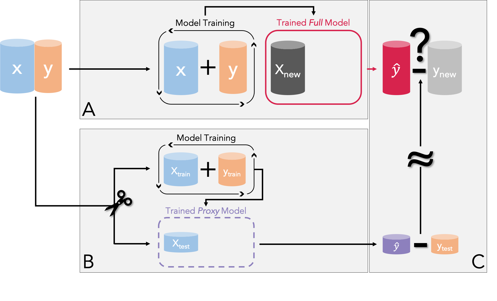
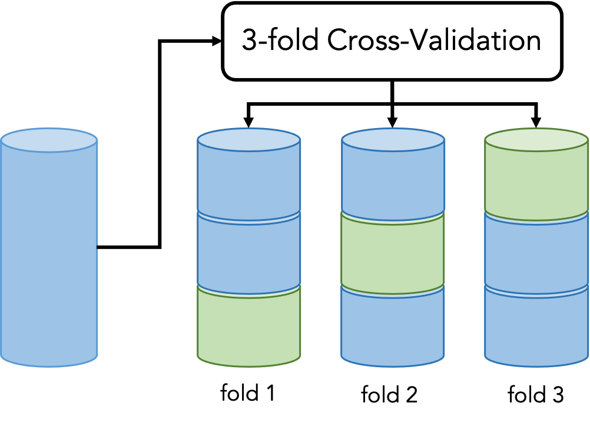
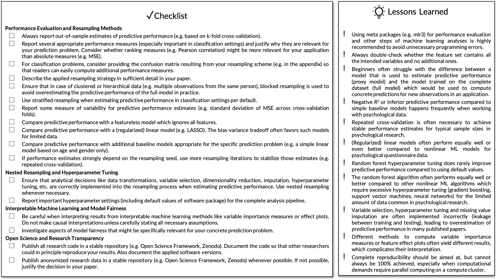

```{r setup, include = FALSE}
library("papaja")
r_refs("r-references.bib")
```

```{r analysis-preferences}
# set seed for reproducibility
set.seed(42)
# some figure and color options
knitr::opts_chunk$set(cache.extra = knitr::rand_seed)
knitr::opts_chunk$set(echo = TRUE, fig.align = "center", tidy = FALSE, comment = NA,
  message = FALSE, warning = FALSE, cache = FALSE, autodep = FALSE, eval = TRUE)
options(scipen = 1, digits = 2, ggplot2.discrete.colour = list(RColorBrewer::brewer.pal(3, "Dark2"), RColorBrewer::brewer.pal(10, "RdYlBu"), rep(RColorBrewer::brewer.pal(10, "RdYlBu"), 6)))
# remove verbose mlr3 output everywhere in the manuscript 
lgr::get_logger("mlr3")$set_threshold("error")
lgr::get_logger("bbotk")$set_threshold("error")
```

Over the past decade, *supervised machine learning* (ML) is appearing with increasing frequency in psychology and other social sciences.
In psychology, ML has been used to tackle such diverse topics as predicting psychological traits from digital traces of online and offline behavior [@Kosinski2013; @youyou_computer-based_2015; @Stachl2020], modeling consistency in human behavior [@Shaw2022], or investigating the empirical structure of self-regulation [@Eisenberg2019].
This popularity can be traced to a number of features: a focus on prediction which complements traditional methods that emphasize description and explanation [@Shmueli2010], the flexibility to account for nonlinear patterns in large quantities of data [@Kosinski2016], and an increase in the generalizability of research findings by evaluating predictive performance on new data [@Yarkoni2022].
Together, these features hold the promise of elevating our understanding of the processes that connect human behavior, cognition, and experience while being able to account for real-world complexity [@yarkoni_choosing_2017; @Rocca2021].
However, the application, evaluation, and interpretation of ML based analyses requires new skills and acute awareness of its methodological challenges and limitations.

This tutorial paper aims to be an intuitive but thorough introduction to the fundamentals of supervised ML for students, researchers, and educators in psychology.
Our goal is to de-mystify ML and to help our readers achieve their analytic goals.
We introduce the most important ML concepts, which should enable our readers to safely familiarize themselves with more complex methods in self-study.
Our focus is exclusively on supervised machine learning [@james2021; @kuhn_applied_2013].
We do not cover other branches of machine learning [e.g., unsupervised learning, see @Murphy2022] and more advanced or specific topics [e.g., deep learning, see @Goodfellow2016].
We assume that our readers are familiar with the free open-source statistical programming language `r cite_r()`, linear regression models and their standard application in psychology or other social sciences.

In this tutorial we present ML theory and application side by side.
In each of four consecutive modules, we first introduce key theoretical concepts, prioritizing intuition and visualizations over mathematical formulas.
Then, we apply the theoretical concepts in R, while providing enough details for readers to understand which analysis steps to think about and how to adapt them to their own projects.
Readers will benefit most from our tutorial by following our practical exercises on their own computers (but all major R outputs are included in our manuscript).
The tutorial covers a lot of content and some concepts might seem complicated at first.
We encourage readers to work through the tutorial at their own pace and revisit earlier sections to consolidate what they have learned.
We added a short summary to the end of each module, which should make it easier to continue with the next module at a later time.

Before getting into the first module, we introduce the basic terminology and mindset of supervised ML, and describe the dataset and the software we will use in our practical exercises.
After setting the stage, Module I covers how to use resampling methods to evaluate the performance of ML models.
Module II introduces the nonlinear random forest (and its components regression and classification trees), a type of ML model that is particularly user-friendly and well-suited to predicting psychological outcomes.
Module III is about performing empirical benchmark experiments.
Finally, Module IV discusses the interpretation of ML models, including permutation variable importance measures, effect plots, and the concept of model fairness.
At the end of the tutorial, we provide a single-page *checklist* that can be used as a reminder about important concepts and pitfalls when performing, reporting, or reviewing ML analyses in psychology.
Beyond what we cover in the tutorial, we provide *electronic supplemental materials* (ESM) with additional examples and demonstrations of more advanced topics in an accompanying OSF repository.
All materials for our tutorial, including our reproducible manuscript, the dataset, and the ESM can be found at <https://osf.io/9273g/>.
We also uploaded our tutorial to Code Ocean (LINK) which provides the most convenient way to follow along with our exercises directly in the browser without having to install any software. 

# The Terminology and Mindset of Supervised ML

Scientists often want to predict the value of some variable of interest based on some other predictor variables.
For example, in our own research, we were interested in predicting the *personality trait score* of a person (measured with a questionnaire) based on their *smartphone behaviors* [recorded on their personal smartphone\; @Stachl2020]. 

## Basic Terminology
In supervised ML, the variable of interest (e.g., personality trait score) is often called *target* and the predictor variables (e.g., smartphone behaviors) are called *features*.
We use that terminology in this tutorial.
Depending on the variable type of the target, supervised learning problems are typically divided into regression and classification tasks.
In *regression tasks* the target is continuous (e.g., personality trait score) while in *classification tasks* the target is categorical (e.g., nominal: having an illness or not; ordinal: education level).
For the classification task there is a further distinction:
The target can either have only two distinct values, which is called *binary classification*, or it can have more than two classes (e.g., country of origin), which is called *multiclass classification*.
A visualization of simple regression and classification tasks can be found in ESM 2.1.
We do not cover multiclass classification tasks in this tutorial, but most syntax can be easily adjusted for this setting.

To produce predictions for the target $y$ when presented with concrete values for a series of features $x_1, x_2, ..., x_p$ (with *p* the number of features) requires a *predictive model*. 
The methodological literature distinguishes various types of models, which differ from each other in their structure and type of *model parameters*.
Before a model can make predictions, the model parameters have to be estimated from data.
For that an estimation *algorithm* is used, which is some formal set of rules to determine appropriate parameter values.
Estimating model parameters (cf. model fitting) is often called model *training*, thus only a trained predictive model is ready to make predictions.
When using a dataset for training with values for both the features and the target available, this is called *supervised learning*.
If models are trained without target values, this is called *unsupervised learning* [@Murphy2022].
In the context of supervised machine learning, the terms predictive model and ML model are often used interchangeably.

For example, a simple predictive model is linear regression: $y_i = \beta_0 + \beta_1 x_{1i} + \beta_2 x_{2i} + \dots + \beta_p x_{pi} + \varepsilon_i$, for individuals $i = 1, ..., N$.
The model parameters $\beta_0, \beta_1, \dots, \beta_p$ are usually estimated with the least squares algorithm.
Before training, suitable values for the model parameters are unknown.
During training, the model learns suitable parameter values from a dataset with sample size $N$. 
After training, the resulting parameter estimates $\hat{\beta}_0, \hat{\beta}_1, \hat{\beta}_2, \dots, \hat{\beta}_p$ can be used to compute a prediction $\hat{y}_j$ (e.g., the predicted personality trait score for a certain individual $j$) for some new observation with known feature values (e.g., smartphone behaviors of the same individual) $x_{1j}, x_{2j}, ..., x_{pj}$: $\hat{y}_j = \hat{\beta}_0 + \hat{\beta}_1 x_{1j} + \hat{\beta}_2 x_{2j} + \dots + \hat{\beta}_p x_{pj}$.

Predictive models differ with respect to their *flexibility*.
A relatively inflexible model like linear regression can only account for linear relationships, include manually selected linear interactions, and use a small number of features simultaneously.
A flexible model like the random forest [@breiman_random_2001] promises to automatically learn nonlinear relationships and interactions, while effectively dealing with a large number of features.
If the true relationship between the features and the target is complex, a more flexible model has the potential to produce more accurate predictions when trained on enough data.
Predictive models also differ with respect to their *interpretability*.
The interpretability of a model refers to how easy it is to understand the relationships between feature values and the predictions of the model.
Usually, there is a tradeoff between model flexibility and interpretability.
In more flexible models, interpretability is often more challenging or can be achieved only by applying additional methods, because no simple model equation (cf. linear regression example) is available.


## Predictive Modeling Mindset
When talking about *supervised ML*, this often involves the application of relatively flexible ML models and, more importantly, a "predictive mindset" when performing data analysis.
This mindset is sometimes at odds with how most psychologists were trained to apply statistical models, mostly limited to generalized linear models like linear or logistic regression.
Such "classical modeling" approaches have been described with many names like data, descriptive, and explanatory modeling [@breiman_statistical_2001; @Shmueli2010].
The classical approach aims to understand and model the concrete relationships between variables.
Based on theoretical knowledge or previous work, a statistical model with a specific relationship (e.g., a conditional linear association) is assumed that describes how the data were produced in the population.
Appropriate model fit indices like $R^2$ and residual diagnostics naturally arise from the data generating model and these indices are typically used to determine how well a model fits the available dataset.
After model fit is deemed satisfactory, the focus typically lies in qualitatively interpreting the estimated model parameters (e.g., testing the hypothesis that a $\beta$ coefficient is positive). 

In supervised ML, we usually do not make any explicit assumptions about the data generating process, in the hope that the models can learn the specific functional relationship between the features and the target automatically.
In contrast to evaluating the trained model on the same dataset, which is what is usually done in classical modeling, supervised ML seeks to quantify the predictive performance of models with regard to how well they can predict new, previously unseen observations.
Appropriate performance measures, that defines what is a good prediction, are carefully selected based on the intended model application instead of being derived from an explicit data model.
After model evaluation, the focus is on concrete predictions while the trained model parameters are often of secondary interest or not considered at all.
Two (idealistic) assumptions are necessary for a trained model to make accurate predictions for new observations:
First, all observations (those used to train the model and those used to evaluate the model) have to be randomly drawn from the same population.
Second, when making predictions, the relationship in the population has not changed since the model was trained.
Of course, predictions can also be computed for observations from a different population.
However, a realistic estimate of predictive performance in this case requires reevaluating the model on data from this new population.

To get to the core of ML, it is important to embrace this "predictive mindset" when performing data analysis in an ML framework;
this requires a thorough understanding of model evaluation in supervised ML. 
For example, how do we quantify the predictive performance of models with regard to how well they can predict new, previously unseen observations?
That is why we dedicate Module I exclusively to this topic.

## Summary of the Terminology and Mindset of Supervised ML

The first chapter set the stage for the main modules of our tutorial by introducing the basic terminology of supervised ML and helping readers to adopt a "predictive mindset" that focuses on predicting new, unseen observations.
Because ML uses a different language unfamiliar to psychologists, we summarized the most important terms in Table \@ref(tab:terminology-table) to assist readers while working through the rest of the tutorial.
Before we start with Module I, we will shortly introduce the dataset and the software packages, which will be used in the Practical Exercises I to IV.

(ref:terminology-table) A summary of important terminology used in supervised machine learning.

```{r terminology-table, echo=FALSE}
terminology_table <- data.frame(
  Terminology = c(
    "Target", "Features", "Task", "Predictive Model/ ML Model", "Model Parameters", 
    "Algorithm", "Model Training", "Trained Model", 
    "Flexibility", "Interpretability"
  ),
  Description = c(
    "The variable to predict (e.g., personality trait score)",
    "Predictor variables (e.g., aggregated smartphone behaviors)",
    "A concrete prediction problem in supervised ML, defined by a target and features. Depending on the type of the target variable, the task is either called a regression (continuous target, e.g., personality trait score) or a classification task (nominal target, e.g., having an illness or not; ordinal target, e.g., education level)",
    "A type of model that can produce a prediction for the target when presented with a concrete value for each feature (e.g., linear regression)",
    "One aspect in which different types of models differ from each other. Must be estimated from data before a model can make predictions (e.g., beta coefficients in linear regression)",
    "A formal set of rules that is used to estimate appropriate values for the model parameters from data (e.g., least squares algorithm)",
    "The process of estimating the model parameters of a predictive model from data",
    "A predictive model, which has been trained (i.e., it has learned suitable values for its model parameters) and is now ready to make predictions",
    "Predictive models vary in their flexibility to adapt to the true functional relationship in the population. Inflexible: account for linear relationships, manually selected linear interactions, small number of features; Flexible: account for nonlinear relationships, large number of features, automatically learns nonlinear interactions",
    "Predictive models vary in their degree of interpretability, that is how easy it is to comprehend the relationship between feature values and model predictions. More flexible models tend to be more difficult to interpret"
  )
)
apa_table(terminology_table,
  caption = "(ref:terminology-table)",
  align = c("m{3.3cm}", "m{12.5cm}"),
  midrules = 1:9,
  escape = TRUE
)
```

# Datasets Used in Practical Exercises
Throughout the tutorial, we use the publicly available *PhoneStudy* behavioral patterns dataset, which has been used to predict human personality from smartphone usage data [@Stachl2020].
Subsets of these data have also been used in a number of other publications [@stachl_personality_2017; @schoedel_digital_2018; @Harari2019; @Schuwerk2019; @Schoedel2020; @Au2021; @Sust2022].
The dataset contains self-reported questionnaire data of personality traits measured with the German Big Five Structure Inventory [BFSI\; 5 factors and 30 facets, @arendasy_manual_2011], demographic variables (age, gender, education), and behavioral data from smartphone sensing (e.g., communication and social behavior, app-usage, music consumption, overall phone usage, day-nighttime activity).
The smartphone sensing data were recorded for up to 30 days on the personal smartphone of 624 study volunteers, bundled from several smaller studies [e.g., @stachl_personality_2017].
Here, we use the dataset for the following regression task:
We predict the continuous personality trait score for the sociability facet of the trait extraversion based on 1821 features of aggregated smartphone usage behavior (e.g., a person's average number of telephone calls at night).
Demonstrating ML concepts on a real dataset is important for getting a feeling for common obstacles but it also means that not all context specific details can be discussed exhaustively.
More details on the dataset can be found in @Stachl2020, along with an in-depth discussion of the research question and interpretation of the final results.
We use the *PhoneStudy* dataset to demonstrate the main ML methods introduced in each module.
However, when the dataset is too complex to allow for an intuitive illustration of some theoretical concepts, we use two more simplistic open datasets from the general ML literature: *AmesHousing* and *Titanic*.^[We use the AmesHousing dataset included in the *AmesHousing* R package [@ameshousing_2020] and the Titanic dataset included in the *rpart.plot* R package [@rpartplot_2021].]

# Software Used in Practical Exercises
Throughout the tutorial, we will use an ML framework that provides a unified interface to train, evaluate, and interpret ML models, which helps users to write modeling syntax that is shorter and less error-prone.
There are several popular frameworks available in the main coding languages [e.g., tidymodels in R, @tidymodels; scikit-learn in Python, @scikitlearn].
Here, we will use *mlr3* [@mlr3] and *DALEX* [@dalex]: 
*mlr3* (and its companion packages) provides a standardized interface to perform ML analyses in the open-source statistical programming language `r cite_r()`; *DALEX* provides functionality for model interpretation.
A detailed tutorial on *mlr3* is available as a free e-book [@mlr3book2022] at <https://mlr3book.mlr-org.com/>.
The *mlr3* package is written in the object-oriented programming system *R6* [@R-R6], which is why some *mlr3* syntax looks unfamiliar to readers used to base R.
In ESM 2.2, we highlight possible sources of error for users unfamiliar with *R6* and give advice on how to effectively look up information in the extensive mlr3 documentation.

# Module I: Performance Evaluation

## Performance Evaluation in Theory: Basics
In the first module of our tutorial, we cover the most important concept of predictive modeling: *performance evaluation*.
Responsible use of ML mandates a thorough evaluation of the quality of a trained predictive model based on the magnitude of error that can be expected for new (unseen) data from the same population.
What does this mean?
Imagine we have trained a predictive model (i.e., the model is ready to make predictions).
Before we apply the model in practice, we want to know how well it will predict observations in our practical application, where the true target values are not available.
So the key question is how to quantify the quality of models. 

### The Bias-Variance Tradeoff

The so-called *bias-variance tradeoff* can be a helpful mental model, which we introduce with the following thought experiment:
We have two models of different flexibility and they greatly differ in their predictive performance (i.e., how well they predict new unseen data).
What factors influence the performance of a predictive model, in theory?

The *expected prediction error* of a predictive model consists of *bias*, *variance*, and *noise* [@james2021].
A metaphorical illustration is given in ESM 2.3.
Before we continue with a graphical illustration, consider the following simplified definitions:
*Expected prediction error* is the average prediction error we would expect when repeatedly fitting the same ML model on many samples of a certain size and measuring the prediction error based on new samples with a large size.
We assume all samples are randomly drawn from the same population of interest.
*Bias* is the deviation of the average prediction from the true value.
*Variance* is the variability of predictions based on different samples.
*Noise* is the irreducible error of the true model in the population.

```{r, echo=FALSE}
library(ggplot2)
library(gridExtra)

# population model
f <- function(x)10*sin(0.8*x)+x

sim <- function(n, f, xmin = -5, xmax = 5, sigma = 5){
  x = runif(n, xmin, xmax)
  y = f(x) + rnorm(n, sd = sigma)
  data.frame(x, y)
}

bias_plot <- function(data, y_mean, y_10, y_90){
  ggplot(data = data, aes(x = x, y = y, colour = sample)) +
    geom_point(size = 0.8) + 
    geom_vline(xintercept = 2.5, linetype = "dashed", 
      linewidth = 0.6, col = "darkgrey") + #black line for x = 2.5
    geom_line(stat="smooth", method = "lm", size = 0.8, alpha = 0.3) + 
    stat_function(fun = f, color = "black", size = 0.6) + 
    geom_point(aes(x = 2.5, y = y_10), col = "black", shape = 95, size = 6) +
    geom_point(aes(x = 2.5, y = y_90), col = "black", shape = 95, size = 6) + 
    geom_point(aes(x = 2.5, y = y_mean), col = "black", shape = 4, size = 3) +
    xlim(-5, 5) + ylim(-33, 32) + theme_bw() +
    theme(legend.position="none")
}

var_plot <- function(data, y_mean, y_10, y_90){
  ggplot(data = data, aes(x = x, y = y, group = sample, colour = sample)) +
    geom_point(size = 0.7) + 
    geom_vline(xintercept = 2.5, linetype = "dashed", 
      linewidth = 0.6, col = "darkgrey") +  #black line for x = 2.5
    geom_line(stat = "smooth", method = "lm", formula = y ~ poly(x, d, raw = TRUE), size = 0.8, alpha = 0.3) + 
    stat_function(fun = f, color = "black", size = 0.4) + 
    geom_point(aes(x = 2.5, y = y_10), col = "black", shape = 95, size = 6) +
    geom_point(aes(x = 2.5, y = y_90), col = "black", shape = 95, size = 6) +
    geom_point(aes(x = 2.5, y = y_mean), col = "black", shape = 4, size = 3) +
    xlim(-5, 5) + ylim(-33, 32) + theme_bw() +
    theme(legend.position="none") 
}


## Example 1
# simulate data
n <- 12 # number of points per sample
m <- 60 # number of samples
d <- 7 # degree of polynomial

set.seed(5)
dat <- Reduce(f = rbind, x = lapply(1:m, FUN = function(x){sim(n, f)}))
dat$sample <- factor(rep(1:m, each = n))

## get predictions for x = 2.5 for better visualization 
df_results_bias_1 <- data.frame(sample = unique(dat$sample), y_hat = NA)

for(i in unique(dat$sample)){
  fit_bias1 = lm(y~x, dat[dat$sample == i, ])
  df_results_bias_1$y_hat[df_results_bias_1$sample == i] = predict.lm(fit_bias1, data.frame(x = 2.5)) 
}

perc_b1 <- quantile(df_results_bias_1$y_hat, c(0.10, 0.90))

bias_1 <- bias_plot(dat, y_mean = mean(df_results_bias_1$y_hat), y_10 = perc_b1[1], y_90 = perc_b1[2]) + 
  ggtitle(label = "Inflexible Model", subtitle = "A1") + 
  theme(plot.title = element_text(size = 15, hjust = 0.5),  plot.subtitle = element_text(size = 15)) +
  annotate("label", x = 0, y = -32, size = 3, label = "Bias: High | Variance: Low") 
  
  
## get predictions for x = 2.5 for better visualization 
df_results_var1 <- data.frame(sample = unique(dat$sample), y_hat = NA)
  
for(i in unique(dat$sample)){
  fit_var1 = lm(y ~ poly(x, d, raw = TRUE), dat[dat$sample == i, ])
  df_results_var1$y_hat[df_results_var1$sample == i] = predict.lm(fit_var1, data.frame(x = 2.5)) 
} 
  
perc_v1 <- quantile(df_results_var1$y_hat, c(0.10, 0.90))

var_1 <- var_plot(dat, y_mean = mean(df_results_var1$y_hat), y_10 = perc_v1[1], y_90 = perc_v1[2]) + 
  ggtitle(label = "Flexible Model", subtitle = "B1") + 
  theme(plot.title = element_text(size = 15, hjust = 0.5), plot.subtitle = element_text(size = 15)) +
  annotate("label", x = 0, y = -32, size = 3, label = "Bias: Low | Variance: High")


## Example 2
# simulate data
n <- 50 # number of points per sample
m <- 60 # number of samples
d <- 7 # degree of polynomial

set.seed(5)
dat <- Reduce(f = rbind, x = lapply(1:m, FUN = function(x){sim(n, f)}))
dat$sample <- factor(rep(1:m, each = n))

## get predictions for x = 2.5 for better visualization 
df_results_bias_2 <- data.frame(sample = unique(dat$sample), y_hat = NA)

for(i in unique(dat$sample)){
  fit_bias2 <- lm(y~x, dat[dat$sample == i, ])
  df_results_bias_2$y_hat[df_results_bias_2$sample == i] <- predict.lm(fit_bias2, data.frame(x = 2.5)) 
} 

perc_b2 <- quantile(df_results_bias_2$y_hat, c(0.10, 0.90))

bias_2 <- bias_plot(dat, y_mean = mean(df_results_bias_2$y_hat), y_10 = perc_b2[1], y_90 = perc_b2[2]) + 
  ggtitle(label = "Inflexible Model", subtitle = "A1") + 
  theme(plot.title = element_text(size = 15, hjust = 0.5),  plot.subtitle = element_text(size = 15)) +
  annotate("label", x = 0, y = -32, size = 3, label = "Bias: High | Variance: Low") 


## get predictions for x = 2.5 for better visualization 
df_results_var2 <- data.frame(sample = unique(dat$sample), y_hat = NA)

for(i in unique(dat$sample)){
  fit_var2 <- lm(y ~ poly(x, d, raw = TRUE), dat[dat$sample == i, ])
  df_results_var2$y_hat[df_results_var1$sample == i] <- predict.lm(fit_var2, data.frame(x = 2.5)) 
} 

perc_v2 <- quantile(df_results_var2$y_hat, c(0.10, 0.90))

var_2 <- var_plot(dat, y_mean = mean(df_results_var2$y_hat), y_10 = perc_v2[1], y_90 = perc_v2[2]) + 
  ggtitle(label = "", subtitle = "B2") + 
  theme(plot.subtitle = element_text(size = 15)) +
  annotate("label", x = 0, y = -32, size = 3, label = "Bias: Low | Variance: Low")


## arrange plots and create texts
example_1 <- ggplot() + annotate("text", x = 1, y = 1, size = 5, label = "Example 1: \nN = 12") + theme_void() 
example_2 <- ggplot() + annotate("text", x = 1, y = 1, size = 5, label = "Example 2: \nN = 50") + theme_void() 
```

(ref:biasvariance-caption) Visualization of the bias-variance tradeoff by fitting ML models with different flexibility on multiple samples (one color per sample) from a nonlinear population model (black). Left column: inflexible (linear) model; right column: flexible (7th degree polynomial) model; first row: 60 samples with N = 12 each; second row: 60 samples with N = 50 each. Mean (cross), 0.1 and 0.9 quantiles (bars) of model predictions are displayed at x = 2.5 (vertical line).

```{r biasvariance, echo=FALSE, warning=FALSE, fig.cap = "(ref:biasvariance-caption)", fig.height=5.5, out.width="85%", fig.align='center'}
lay <- rbind(c(1, 2, 2, 3, 3),
             c(1, 2, 2, 3, 3),
             c(4, 5, 5, 6, 6),
             c(4, 5, 5, 6, 6))
grid.arrange(example_1, bias_1, var_1, example_2, bias_2, var_2, 
  ncol = 3, nrow = 2, widths = c(1, 2, 2))
```

Counterintuitively, bias and variance are not attributes of a single trained model but refer to how a particular ML model would perform when fitted to repeated samples from the same population (e.g., collecting multiple samples of German psychology students).
Figure \@ref(fig:biasvariance) illustrates the bias-variance tradeoff.
The black line represents the population model, from which we draw samples of size $N = 12$ for Example 1 (first row) and $N = 50$ for Example 2 (second row).
Each set of points with the same color represents one sample.
In both examples, we fit an inflexible linear model (colored curves, left column) and a flexible 7th degree polynomial (colored curves, right column) to each sample.
We will look at how closely the models can reproduce the functional shape of the population model, from which we simulated the data.
Please keep in mind that in practice, all we have is a single sample from the population (one set of points and models fitted to these points).
We cannot fit models to multiple samples and we do not know the underlying population model.
Thus, a figure like this one can be produced only for simulated data.

To better "see" bias and variance, we ask our readers to visually focus on Example 1, where we use small sample sizes.
If we pick a single point on the x-axis (e.g. $x = 2.5$ in the figure) and compare the vertical average of the colored curves (the cross) with the black line, we see that the average prediction across samples is close to the population model for the flexible models (Panel B1).
In contrast, the average prediction of the inflexible models (Panel A1) is far away from the population model (this is true for most values of $x$, although the deviation is small for some $x$ values like $x = 0$).
Thus, the bias is relatively high for the inflexible and low for the flexible model.
We can find the exact opposite pattern for variance.
The variance is relatively low for the inflexible (Panel A1) but high for the flexible model (Panel B1).
If we pick a single point on the x-axis (e.g. $x = 2.5$ in the figure) and inspect the vertical variance of the colored curves (the bars), we see that for each value of $x$, the variance of the predictions is high across the flexible models but low across the inflexible models in Example 1.

Figure \@ref(fig:biasvariance) also illustrates that the bias-variance tradeoff can be heavily influenced by sample size if we compare Examples 1 and 2.
Both the inflexible and flexible model are trained on small samples ($N = 12$) from the population in Example 1 and on larger samples ($N = 50$) in Example 2.
If our task was to find the model with the "best" bias-variance tradeoff in in the small-sample setting, the inflexible model (which is guaranteed to miss the population model; Panel A1) would probably be preferred over the flexible one (which will sometimes miss the population model by a large margin; Panel B1).
In contrast, the flexible model (Panel B2) would be preferred over the inflexible one (Panel A2) in the big sample setting.
The bigger sample size sufficiently reduces the variance while keeping the bias low, which results in a very close fit to the population model and consequently a low expected prediction error.

To conclude, when we aim to quantify predictive performance or to compare different ML models, it is helpful to keep the bias-variance tradeoff in mind.
The goal of supervised ML is always to strike a good bias-variance tradeoff -- to find a predictive model with both low bias *and* low variance.
However, ML cannot escape from a general principle in statistics: more flexible models with weaker assumptions about the true functional relationship require more data to be effective.

### Performance Measures 
In the previous section, we used vague definitions of prediction error and predictive performance to give an intuition of what it means for a predictive model to perform well.
However, before we can evaluate a given ML model in practice, we need concrete definitions of prediction error for model predictions.
Let us assume that someone provides us with a set of true target values and the corresponding predictions of a model.
Without knowing anything about where these predictions come from, how would we quantify how good the predictions are?
The first step of model evaluation is thus to select appropriate performance measures, depending on the task type (i.e., regression or classification), research questions, and whether we want to use standard measures or whether we have expert knowledge leading to custom measures relevant for our specific model application.

#### Regression Tasks
Performance measures for regression quantify a "typical" deviation from the true target value.
The default measure is the *mean squared error*, $MSE = \frac{1}{N} \sum_{i=1}^N (y_i-\hat{y}_i)^2$.
The MSE is the mean of the squared residuals $y_i-\hat{y}_i$, with $y_i$ indicating the true target value and $\hat{y}_i$ indicating the predicted target value of observation $i$.
The higher the deviation of the *predicted* from the *true* target value, the higher the prediction error (i.e., the worse our model predictions).
As a result of squaring the residuals, both positive and negative deviations increase the error, and large deviations are weighted more strongly.
The MSE is 0 only if all predictions are perfect but there is no upper limit for bad predictions.
MSE values are hard to compare across applications because the values depend on the measurement unit of the target.
Because the MSE is measured in squared units, the absolute values are even more difficult to interpret.
Many researchers prefer the *root mean squared error* $(RMSE = \sqrt{MSE})$ which is in the same unit as the target.
Alternative measures can be constructed by using absolute instead of squared differences (*mean absolute error*) or by computing the median instead of the mean (*median squared error* or *median absolute error*).

In the social sciences, the *coefficient of determination* ($R^2$) is often used as a performance measure because it is familiar from linear regression:
$R^2 = 1- \frac{residual\ sum\ of\ squares}{total\ sum\ of\ squares} = 1-\frac{\sum_{i=1}^N (y_i-\hat{y}_i)^2}{\sum_{i=1}^N (y_i-\bar{y})^2}$.
There are alternative ways to compute $R^2$ which should not be used in the ML setting because the equivalence holds only for linear regression (e.g., simply squaring the Pearson correlation between predictions and target values).
Like $MSE$, $R^2$ is based on the *residual sum of squares*, which is then standardized by the *total sum of squares*.
This computation results in a relative measure, with a maximum value of 1 only if all predictions are perfect.
Note that a model which predicts the mean target value for all observations $\hat{y}_i=\bar{y}$ would result in $R^2 = 0$ which is a useful reference point.
$R^2$ is often introduced in the context of measuring model fit in linear regression, where values of $R^2$ range from 0 to 1.
However, in general $R^2$ is not bound to 0 and can assume values below zero.
Negative values of $R^2$ imply that the predictions are worse compared to a simple baseline model which does not use any feature information (e.g., predicts the mean target value which is often called a *featureless learner*).
We will encounter this case in one of our demonstrations.

#### Classification Tasks
Measuring classification performance is often less straightforward compared to regression tasks.
We consider only binary classification in which the target has only two possible values (coded as 0 and 1 by convention), but there are comparable performance measures for multiclass classification [@ferri2009].
The simplest idea to construct a performance measure is to compute the proportion of misclassified observations, which results in the *mean misclassification error*, $MMCE = \frac{1}{N} \sum_{i=1}^N I(y_i \neq \hat{y_i})$.
The indicator function $I(.)$ takes the value 1 if the condition in the bracket is true and 0 if the condition is false.
MMCE counts how often our model made the wrong prediction and relates it to the total number of predictions.
Instead of quantifying prediction error, we could also measure prediction accuracy as $ACC = 1 - MMCE$.
Note that in the standard case where all predictions have the value 0 or 1, the MMCE can also be computed with the MSE formula, which highlights the similarity between both standard measures. 
For most applied classification problems, the isolated consideration of the MMCE is of limited value, and additional measures should be considered. 
These additional measures are particularly important when different errors have different consequences or associated costs (e.g., giving cancer treatment to a person without cancer vs. not treating a cancer patient), or if both classes are unequally represented in the dataset (e.g., more healthy people than people suffering from an illness).
Most useful classification measures (including the MMCE) are computed from a confusion matrix in Table \ref{tab:table-confusion}, which shows the number of *true positive* (TP), *false positive* (FP), *true negative* (TN), and *false negative* (FN) predictions.

\begin{table}[]
\caption{\label{tab:table-confusion}Confusion Matrix}
\begin{tabular}{|cc|cc|}
\hline
\multicolumn{2}{|c|}{\multirow{2}{*}{}}                  & \multicolumn{2}{c|}{Truth $y_i$} \\ \cline{3-4} 
\multicolumn{2}{|c|}{}                                   & \multicolumn{1}{c|}{1}   & 0  \\ \hline
\multicolumn{1}{|c|}{\multirow{2}{*}{Prediction $\hat{y_i}$}} & 1 & \multicolumn{1}{c|}{TP}  & FP \\ \cline{2-4} 
\multicolumn{1}{|c|}{}                               & 0 & \multicolumn{1}{c|}{FN}  & TN \\ \hline
\end{tabular}
\end{table}

From the context of diagnostics and assessment, many psychologists are familiar with the *sensitivity* or *true positive rate/recall*: $SENS = TP/(TP+FN)$ and the *specificity* or *true negative rate*: $SPEC = TN/(TN+FP)$.
Related measures are the *positive predictive value*: $PPV = TP/(TP+FP)$ and the *negative predictive value*: $NPV = TN/(TN+FN)$.
Also important is the *area under the receiver operating curve* (AUC), which can be interpreted as the probability that an observation randomly drawn from class 1 has a higher predicted probability than an observation randomly drawn from class 0.
AUC is based on the *receiver operating curve* (ROC) which plots $1-SPEC$ against $SENS$.
Each combination results from a different prediction threshold, that means we predict class 1 if the predicted probability for class 1 is greater than the threshold (0.5 by default).
For more advanced techniques, @sterner2021 give an introduction to cost-sensitive learning for psychologists with mlr3.

### Resampling Strategies for Model Evaluation
In ML, it is always the predictive performance on *new observations* which is of practical and theoretical interest.
Thus, we want to know how well a model trained on a specific dataset will predict new, unseen data (*out-of-sample* performance).
The ideal approach would be to collect a new sample from the same population.
However, this approach is often not feasible in practice.
A naive alternative would be to estimate predictive performance based on the same data used to train the model (*in-sample* performance).
Unfortunately, this procedure can lead to an extreme overestimation of predictive performance, which we will demonstrate later.
Too flexible models can perfectly predict all observations they have been trained on but the predictions for new observations can be disastrous.
A better approach for model evaluation is to use *resampling methods*, which are a smart way of recycling the available data to estimate *out-of-sample* performance.
The general principle is to use the available sample to *simulate* what happens when the trained model will be applied on new observations in a practical application.
To produce a realistic estimate of expected performance, resampling methods must ensure a strict separation of model fitting and model evaluation.
This rule implies that different data must be used for training and testing the model.

#### The Idea Behind Resampling

One of the simplest resampling strategies is to randomly split the data into a *training set* and a *test set*.
The training set is used to train the model, while the test set is used to compute predictions and estimate predictive performance.
Imagine we have a dataset from a random sample consisting of a target $y$ and a set of features $X$, as displayed in Figure \@ref(fig:perfevaluation).
We use the entire dataset to train an ML model, which we want to use in a practical application (panel A).
We call this the *full model* (shown in red), because it used all of the available data.
The full model learns a functional relationship between the features and the target. 
For new observations (i.e., when we apply the model in practice), the feature values $X_{new}$ can be fed to the trained full model to produce predictions $\hat{y}$.
Before we use these predictions in our application, we want to know how well our trained full model performs.
Unfortunately, we cannot compute performance measures for our new observations because the true target values $y_{new}$ are not available.
To get an estimate of the predictive performance of our full model, we randomly split our dataset into two parts (panel B):
First, the training set is used to train a *proxy model* (shown in purple).
Second, feature values from the test set are fed to the proxy model to compute predictions.
Third, we compute a performance measure (e.g., MSE) for the test set predictions.
Calculating performance is possible, because the true target values are available for our test set data.
It can be shown that [under some reasonable conditions\; @james2021] the computed performance is a realistic yet conservative estimate of the predictive performance of our full model (see panel C).
To compute predictions in a practical application, we would always use the *full* model, which was trained on all available data.
The smaller proxy model which is based on the training set will *not* be used to make predictions in practice, but merely tells us how well the full model will likely work.
In other words, the proxy model is a tool to estimate predictive performance and can be discarded after producing the test set predictions.

(ref:perfevaluation-caption) A visualization of how predictive performance is evaluated in supervised ML. Panel A displays the training of the full model (red), which can later be used in an application (i.e., to predict new observations). The predictive performance of the full model is estimated by resampling. For this purpose, a proxy model (purple) is trained on a training set (Panel B) and the predictive performance computed on the corresponding test set (Panel C) is used as an estimate of the predictive performance of the full model.    

```{r perfevaluation, echo=FALSE, warning=FALSE, fig.cap= "(ref:perfevaluation-caption)", fig.align='center', out.width="100%"}

```

Why is it necessary to separate training and test data rather than computing the performance based on the complete dataset that we used to train the full model?
Flexible ML models sometimes adjust to a set of given data points too closely, a phenomenon which is often called *overfitting*.
If a model overfits to the data, it learns sample-specific patterns ("fitting the noise") that will not generalize to new samples from the same population.
Overfitting can also be thought as "learning something by heart": the model exactly recognizes each observation it has been trained on but cannot transfer any information to new observations it has not seen before.
We will see later on that especially for flexible ML models, in-sample performance is useless to judge a model's performance on new data.

```{r, echo=FALSE, include=FALSE}
## prepare visualization 
library(patchwork)
library(cowplot)
library(magick)
library(ggplot2)

## script to create pngs
## this script creates pngs and stores them in figures/temp; for the R Markdown file the pngs are read and integrated in the document 
### did not find a solution to directly print and arrange the plots in the manuscripts (RS)
dir.create("Figures/temp")

# code was provided by the working group of computational statistics 
# led by Bernd Bischl at LMU Munich

# plot "Example of Overfitting/Model Evaluation I"

.h <- function(x) 0.5 + 0.4 * sin(2 * pi * x)
h <- function(x) .h(x) + rnorm(length(x), mean = 0, sd = 0.05)
n <- 22L
set.seed(123)
x.all <- seq(0, 1, length = n)
ind <- c(1, sample(1:(n-1), size = round((n-3)/2), replace = FALSE), n)

x <- x.all[ind]
y <- h(x)
x.test <- x.all[-ind]
y.test <- h(x.all[-ind])

line.palette <- RColorBrewer::brewer.pal(3, "Dark2")
baseplot <- function() {
  par(mar = c(2, 2, 1, 1) + 2.2)
  plot(.h, lty = 2L, xlim = c(0, 1), ylim = c(-0.1, 1), ylab = "", xlab = "", cex.axis = 0.8)
  points(x, y, pch = 19L)
  points(x.test, y.test)
  legend(x = "bottomleft", legend = c("population", "training set", "test set"),
         col = "black", lty = c(2L, NA, NA), pch = c(NA, 19L, 21L), cex = 0.8)
}

p1 <- lm(y ~ poly(x, 1, raw = TRUE))
p3 <- lm(y ~ poly(x, 3, raw = TRUE))
p8 <- lm(y ~ poly(x, 8, raw = TRUE))
mods <- list(p1, p3, p8)
x.plot <- seq(0, 1, length = 500L)

## create plot and save 
png("Figures/temp/OME_I.png", width = 15, height = 10, units = "cm", res = 1000)
baseplot()
for (i in seq_along(mods)) {
  lines(x.plot, predict(mods[[i]], newdata = data.frame(x = x.plot)),
        col = line.palette[i], lwd = 2L)
}
legend("topright", c("flexibility too low", "flexibility optimal", "flexibility too high"),
       col = line.palette, lwd = 2L, cex = 0.8)

d <- lapply(1:9, function(i) {
  mod <- lm(y ~ poly(x, degree = i, raw = TRUE))
  list(
    train = mean((y - predict(mod, data.frame(x = x)))^2),
    test = mean((y.test - predict(mod, data.frame(x = x.test)))^2)
  )
})
title(xlab = "x", ylab = "y", cex.lab = 0.8)

dev.off()

# plot "Example of Overfitting/Model Evaluation II"
# code was provided by the working group of computational statistics 
# led by Bernd Bischl at LMU Munich

## create plot and save 
png("Figures/temp/OME_II.png", width = 15, height = 10, units = "cm", res = 1000)

par(mar = c(4, 4, 2, 2) + 1)
plot(1, type = "n", xlim = c(1, 9), ylim = c(0, 0.06),
     ylab = "MSE", xlab = "degree of flexibility", cex.lab = 0.8, cex.axis = 0.8)
lines(1:9, sapply(d, function(x) x$train), type = "b")
lines(1:9, sapply(d, function(x) x$test), type = "b", col = "gray")

legend("topright", c(expression(MSE[train]), expression(MSE[test])), lty = 1L, 
       col = c("black", "gray"), cex = 0.8)
text(3.75, 0.02, "high bias,\nlow variance", bg = "white", cex = 0.8)
arrows(4.75, 0.02, 2.75, 0.02, code = 2L, lty = 2L, length = 0.1)

text(8, 0.02, "low bias,\nhigh variance", bg = "white", cex = 0.8)
arrows(9, 0.02, 7, 0.02, code = 1, lty = 2, length = 0.1)

dev.off()

## read pngs
overfitting1 <- ggdraw() +  draw_image("Figures/temp/OME_I.png")
overfitting2 <- ggdraw() +  draw_image("Figures/temp/OME_II.png")

overfitting <- overfitting1 / overfitting2
```

(ref:overfitting-caption) Panel A shows observations drawn from a nonlinear population model (dotted line), which are divided into a training (black dots) and a test set (framed dots). Three models of varying flexibility (polynomials of degree 1 in green, 3 in orange, and 8 in purple) were fitted to the training set. Panel B shows the relationship between model flexibility (polynomials of degree 1 to 9) and predictive performance estimated with training and test MSE. Performance estimates are computed based on the data from Panel A.

```{r Overfitting, fig.cap="(ref:overfitting-caption)", echo=FALSE, fig.width=6, fig.height=7}
overfitting + plot_annotation(tag_levels = 'A') & ggplot2::theme(plot.tag = element_text(size = 12))
```

Figure \@ref(fig:Overfitting) illustrates the concepts of overfitting and model evaluation.
In Panel A, points were simulated from a nonlinear population model (dotted line) and randomly split into a training set (black dots) and a test set (framed dots).
Note that due to the irreducible noise in the data-generating process, even the true population model would not predict observations perfectly.
Three models of varying flexibility were fitted to the training set: polynomial regression models with degree 1 (linear model; green), 3 (orange), and 8 (purple).
The green model clearly *underfits*. 
It is not flexible enough to approximate the population model and makes bad predictions for both training and test observations.
The purple model *overfits*, because its flexibility is too high.
It almost perfectly interpolates all training observations, but the deviations from the test observations can be quite high.
In contrast, the orange model seems to have optimal flexibility and closely approximates the population model.
It roughly predicts training and test observations equally well.
In such a simple example with only one feature, it is possible to visually identify the model with optimal flexibility.
However, with more features this becomes rapidly unfeasible because visualizing more dimensions is difficult.
Fortunately, we can always try to determine the optimal model based on the test set performance. 
In Panel B, training and test MSE were computed on the simulated data from Panel A for polynomial models with flexibility ranging from degree 1 to degree 9, which includes the three models displayed in Panel A.
Remember how to compute the (training) test MSE: for each observation from the (training) test set, take the squared vertical difference between the point and the model prediction; then compute the mean of all squared differences.
The trajectories of training and test performances along the axis of model flexibility show a characteristic pattern:
Prediction error in the training set decreases with increasingly flexible models and almost reaches 0 (perfect interpolation) for degree 9.
We saw in Panel A that models with extremely high flexibility overfit and perform poorly on new observations.
Hence, it becomes clear that we cannot use the training performance to select the optimal model.
In contrast, prediction error in the test set first decreases until degree 3 but then increases again.
This reflects our observation from Panel A that both very low and very high flexibility is not ideal to achieve good predictions for new observations.
In the bias-variance framework, bias decreases with flexibility while variance increases.
The optimal tradeoff in this example seems to be a degree of about 3.
To conclude, if we have to choose between different types of models or model settings, we generally select the model with the best performance on the *test set* (here the model with the lowest MSE).
In theory, we could favor models with lower flexibility among models with comparable test set performance.
However, this is usually not the default in practice.^[For an exception, see the `s = "lambda.1se"` argument of the `coef` and `predict` functions in the *glmnet* R package [@friedman2010].] 

#### Different Types of Resampling Strategies

##### Holdout Estimator
In the previous example, we have worked with the most simple resampling strategy of randomly splitting the data into a *training* and a *test set*.
This strategy is also termed the *holdout* estimator. 
An important practical issue when using the *holdout* estimator is the ideal proportion of data to put into the training and the test set.
The full model is always based on more observations than the proxy model that is fit to only the training set.
Because model quality increases with sample size, test set performance will (on average) be an *underestimate* of the true performance of the full model.
The larger the training set, the smaller this negative bias.
The test set performance is only a point estimate of the true predictive performance of the full model.
Thus, the variance of this estimate is also important.
The larger the test set, the smaller the variance of the performance estimate.
This is a dilemma, because it is obviously not possible to maximize the size of training and test set simultaneously (without collecting more data in the first place).
We can think of this as the *bias-variance tradeoff* of the holdout estimator, which should not be confused with the bias-variance tradeoff of ML models we discussed earlier.^[The holdout estimator would be unbiased if the average holdout estimate for repeated samples from the population were equivalent to the expected prediction error. The variance of the holdout estimator describes the variability of holdout estimates for repeated samples from the population.]
The tradeoff strongly depends on the size of the training and test set but there is no single ratio that is optimal in general.
Rules of thumb [see @james2021] typically suggest to use 2/3 of the full data for the training (large enough to learn well) and 1/3 for the test set (large enough for stable performance evaluation).

##### K-fold Cross-Validation
In some ML settings where the amount of data is not a problem, the holdout estimator is sufficient to achieve reasonable performance estimates.
For extremely large (think of "Google sized") datasets, the predictive performance of most ML models saturate (i.e., the performance does no longer improve with increasing amounts of data) and the size difference between the training and the full dataset becomes irrelevant.
At the same time, the variance of the performance estimate computed on the test set will be so small to be almost negligible.
In the social and behavioral sciences, we usually face the situation that data are scarce and their collection are costly and time consuming.
For such smaller datasets, the performance difference between the full and the proxy model as well as high variance of performance estimates from small test sets negatively impact the quality of holdout estimates.
More elaborate resampling strategies try to improve on the holdout estimator by recycling the data in a smarter way.
They optimize the partitioning of the dataset by performing several splits into training and test sets, and aggregating the resulting performance estimates.
The most common resampling method is *k-fold cross-validation* [CV\; @kohavi1995].
@bischl_resampling_2012 give a good overview of CV and alternative resampling techniques like *repeated CV*, *leave-one-out CV*, *bootstrap* or *subsampling*.

(ref:resampling3cv-caption) Visualization of the principle behind 3-fold cross-validation. 

```{r resampling3cv, echo=FALSE, warning=FALSE, fig.cap= "(ref:resampling3cv-caption)", fig.align='center', out.width="50%"}

```

In *k-fold CV*, the dataset is randomly partitioned into $k$ (roughly) equally sized parts.
Each part is used as a test set exactly once, while the remaining parts are combined into a larger training set. 
The CV estimator is the average of the performance estimates from the $k$ test sets.
Figure \ref{fig:resampling3cv} is a visualization of 3-fold CV (i.e., the data are randomly divided into 3 parts).
In the first fold, a proxy model is trained on the combined data from parts 1 and 2, and part 3 (green) are used to compute predictions and calculate the performance measure.
In the second fold, parts 1 and 3 form the training set and part 2 forms the test set. Finally, in the third fold, parts 2 and 3 form the training set and part 1 forms the test set.
The performance estimates from the 3 test sets are aggregated by the arithmetic mean (other aggregation functions like the median are also possible).
Note that each observation from the complete dataset will be used exactly once (it is either in test set 1, 2 or 3) to make a prediction and thus to contribute to the final performance estimate.
For each prediction, the observation in question was *never* used to train the model making that prediction.
However, each observation belongs to 2 of all 3 training sets and thus is used several times to train proxy models.
Compared to holdout, CV reduces the bias by increasing the size of the training sets *and* reduces the variance by aggregating several test set performances.

A simple intuition for those advantages can be given for 2-fold CV, in which the training and the test set have the same size.
Imagine a holdout estimator in which the training and the test set have the same size.
The model is trained on the first part and performance is tested on the second part.
However, if we switched the training and test set, the resulting performance estimate would be of exactly the same quality.
The size of the training set (i.e., the bias) is similar and the size of the test set (i.e., the variance) is also the same.
Additionally, both performance estimates are independent (set assignments were random and sets do not overlap).
Thus, it is intuitive that the 2-fold CV estimator, which computes the mean across both test set performances, will have similar bias but lower variance than each of the two holdout estimators.
Unfortunately, the intuition breaks down for $k > 2$ where the performance estimates are no longer independent because they are based on models trained on overlapping data.
It can be shown that increasing $k$ does not improve the quality of the performance estimator indefinitely [for a simple discussion, see @james2021].
The greater the overlap in the training sets, the higher the similarity between predictions from these models and the less effective the variance reduction from averaging.
Rules of thumb which have proven effective both in benchmark studies and in practical applications recommend 5 or 10 folds.

### Excursus on Sample Size
We want to conclude the section on performance evaluation with a comment on sample size.
By far the best strategy to improve the performance of predictive models for some application is to increase the amount of available data:
For larger samples, i) the variance of model predictions is lower, ii) the potential for flexible models with low bias is higher, iii) the danger of overfitting is lower, iv) the more features can be used effectively, and v) the precision of estimates of predictive performance increases.

## Practical Exercise I: Performance Evaluation with K-fold Cross-Validation

<!-- the first exercise can be found in exercises/1_performance_evaluation.Rmd -->
```{r, child="exercises/1_performance_evaluation.Rmd"}
```

## Performance Evaluation in Theory: Advanced

### Model Optimization
Our first exercise demonstrated how to estimate the predictive performance of a simple predictive model with CV.
However, predictive modeling in practice often entails a series of model decisions [or researcher degrees of freedom, see @Wicherts2016] that have to be considered when estimating predictive performance: i) Hyperparameter tuning, ii) Preprocessing, and iii) Variable selection.

Many types of ML models have *hyperparameters*, which are parameters that are not automatically estimated during the training process by the estimation algorithm.
However, because they can have a big impact on predictive performance, optimal values have to be chosen in a data-dependent way.
Tuning hyperparameters (i.e., finding optimal configurations) typically works similar to our model comparison example in Figure \@ref(fig:Overfitting).
The degree of the polynomial can be seen as a hyperparameter of a general polynomial regression model.
To find the optimal hyperparameter setting, we again use resampling (e.g., a single test set or CV) to estimate predictive performance for different hyperparameter settings, select the hyperparameter value with the best test set performance, and choose the selected value when training the full model on the complete dataset.
Preprocessing operations can also have hyperparameters, which can be tuned in the same way as hyperparameters of ML models.
A simple example for a categorical hyperparameter would be whether to use the mean or the median for data imputation.
Regarding variable selection, sometimes it can be a good strategy to not include all possible features in a predictive model but only a subset of particularly informative features.
A simple method for regression tasks is to compute the Pearson correlation for each feature with the target and use only the features with the highest target correlations when training the full model.
Note that the number of features selected is a hyperparameter of this variable-selection strategy, which could again be tuned with CV.

### Nested Resampling
Modeling decisions like those mentioned above are often implemented in a way that makes data-dependent choices before the full model is trained on the entire dataset (e.g., predictive performance of mean and median imputation is compared on a test set to decide which method to use for the full model).
To estimate predictive performance correctly when data-dependent choices have been made, it is of utmost importance to focus on the complete *modeling pipeline*, that contains the hyperparameters of the ML model and all previous or consecutive steps like feature preprocessing or variable selection.
For each training set in the resampling process used to estimate predictive performance, *all* data-dependent model decisions have to be repeated in exactly the same way as they are performed when producing the *full* model (which will actually be used to compute predictions in practical applications).
This procedure entails the possibility that in some training sets, different hyperparameter settings are chosen than in the full model.
That phenomenon might seem unintuitive, but it is unproblematic.

If data-dependent model decisions are not repeated within resampling, the predictive performance of the full model can be grossly overestimated.
This mistake is most commonly observed when tuning the hyperparameters of ML models:
First, researchers try out different hyperparameter combinations to find the setting with the best predictive performance in-sample or with resampling.
For example, in accordance with Figure \@ref(fig:Overfitting), they determined that a 3rd degree polynomial seems optimal.
Then they use this hyperparameter setting to train a full model based on the complete dataset, which is fine.
However, to estimate the predictive performance of their full model, they run holdout or CV but use the degree setting from the full model in each training set.
To obtain a realistic performance estimate of their full model, they should instead have repeated the tuning process of finding the optimal polynomial degree within each training set.

If modeling decisions require resampling themselves (e.g., hyperparameter tuning), correctly estimating the predictive performance of such a modeling pipeline results in nested resampling loops.
We do not need *nested resampling* for the practical exercises performed in this tutorial, because we do not employ hyperparameter tuning.
However, we explain nested resampling in ESM 3.2, which also contains a full example with code on how to tune hyperparameters in mlr3.

### Variable Selection
Another prevalent example of overoptimistic predictive performance estimates by not considering data-dependent model decisions in performance evaluation is biased variable selection [@Varma2006].
Researchers might be interested in a sparse, interpretable model and want only to include a certain maximum number of features.
Or they hope that a reduced feature set which contains most of the "signal" might increase predictive performance because the ML model is not distracted by other "noisy" features.
Both can be valid reasons to perform variable selection, but variable selection is often evaluated with the following flawed procedure [@james2021]:
First, researchers determine a limited number of features with the best predictive performance in-sample or with resampling.
They then use the selected features to train a full model based on the complete dataset, which is fine.
However, to estimate the predictive performance of their full model, they run holdout or CV but include the features selected by the full model in each training set.
To obtain a realistic performance estimate of their full model, instead they should have repeated the variable selection process of finding the optimal features within each training set before evaluating on the respective test set.

Biased variable selection invalidates many applied ML papers in the social sciences and threaten the replicability of this literature [see @Monsted2018 for a discussion of biased variable selection in early studies of predicting personality traits with mobile sensing features].
The risk to upwardly bias estimates of predictive performance when performing variable selection on the full dataset instead of repeating it for each resampling iteration is greatly exacerbated in settings with comparatively small samples and a large number of features.
The PhoneStudy dataset with 620 observations and 1822 features represents such a setting.
If variable selection is done incorrectly, it is easy to produce overly optimistic performance estimates of the magnitude reported in the applied mobile sensing literature, even if the data were completely random.
We illustrate this phenomenon in ESM 3.3, where we analyze simulated data which are of the same size as the PhoneStudy dataset but do not contain any true relationship between the features and the target.

### Dependent Observations
A different setting where we also have to be careful not to produce overoptimistic performance estimates exists in the case of clustered, longitudinal, or spatial data [@Roberts2017].
The general principle is again to imagine how the trained model will be used in practice and simulate this process during resampling to avoid bias:
A frequent example is a prediction task in which multiple observations belong to the same person (e.g., repeated experience sampling of daily mood). 
In practice, we want to make predictions for new individuals on which the full model has not been trained.
With standard resampling, the practical performance of the full model will be overestimated because the proxy models will sometimes make predictions for individuals whose observations were also included in the respective training set.
If the model recognizes the person to which an observation belongs (for flexible models, this is often possible without any person id being used as an explicit feature), this memory can facilitate predictions during resampling because observations from the same person tend to be more similar.
However, similar performance cannot be expected for the full model, because it will *never* be able to use such information in the actual application where new cases will not have been part of the training data.
This bias in performance estimates has to be prevented by *blocked resampling* [@Roberts2017]: all observations belonging together must either be in the training or in the test set, but never in both at the same time.
The PhoneStudy dataset is actually a collection of three independent samples [@Stachl2020] and individuals in the same sample might be more similar due to convenience sampling (e.g. participants might have asked their friends to join the study as well).
In ESM 3.4, we present a simple example of blocked resampling based on this group structure.

## Summary of Module I

Module I covered performance evaluation, the most important concept in supervised ML:
The goal of supervised ML is to build powerful predictive models that can be used in practical applications.
As a consequence, estimating how well the model would perform when predicting new observations is central to the "predictive mindset".
We first introduced the so-called bias-variance tradeoff as a mental model to think about prediction error from a conceptual point of view.
However, to practically assess the prediction error in regression or classification tasks, we have to choose an appropriate performance measure and a resampling method.
Practical Exercise I, introduced how to train ML models with the mlr3 package in R and to evaluate their predictive performance with k-fold cross-validation.
To better understand the "predictive mindset", we contrasted in-sample performance (which is the traditional way to evaluate models in psychology) with out-sample performance.
Module I also gave a theoretical preview of more advanced issues in performance evaluation, which become relevant when researchers want to tune hyperparameters, select features, or apply ML on clustered datasets.

# Module II: Random Forests 

Students in the social sciences are often untrained in nonlinear predictive models.
We now introduce the *random forest* [RF\; @breiman_random_2001], a relatively simple yet widely effective nonlinear ML model that can be used for both regression and classification tasks.
We do not claim that the RF is always superior to other models, but it is often highly competitive in medium sized prediction tasks [@Grinsztajn2022] and is well suited to predict psychological outcomes [e.g., @Fife2022; @Stachl2020].
Knowing at least one type of ML model well is helpful to better understand the general principles of ML, to safely apply ML in practice, and to expand to other ML models.
A RF consists of several decision trees [@breiman_classification_1984], which we will outline first to get a good start in understanding how the RF works.
An early discussion of applying tree-based methods in psychological research is @Strobl2009.

(ref:titanictree-caption) CART decision tree fitted to the Titanic classification task. Passenger characteristics are used to predict whether a passenger survived the Titanic disaster. pclass: passenger class, sibsp: number of siblings or spouses aboard, parch: number of parents or children aboard. Node color encodes the classification made for the observations in that node (dark: died, light: survived). 

```{r titanictree, echo=FALSE, fig.cap="(ref:titanictree-caption)", out.width="\\linewidth"}
library(rpart)
library(rpart.plot)

data(ptitanic)
tree <- rpart(survived~., data = ptitanic)
rpart.plot(tree, extra = 1, box.palette = "-Grays")
```

## Classification and Regression Trees in Theory

### Basic Principles

We start with a graphical demonstration based on the *Titanic* dataset which is simpler to interpret than examples based on the PhoneStudy data. 
The decision tree in Figure \@ref(fig:titanictree) predicts whether passengers of the Titanic survived or died in the disaster, dependent on demographic (age, sex) and voyage variables (pclass: passenger class, sibsp: number of siblings or spouses aboard, parch: number of parents or children aboard).
The tree is "grown" from the *root node* on the top which contains all observations in the dataset.
The label above each node (survived vs. died) shows the prediction we would make for each passenger belonging to this node.
The numbers below the label show how many passengers died (left) and survived (right).
Below each node, we see some logical criterion used to split the *parent node* into exactly two *child nodes*.
Passengers are sent to the left child node if the *split-condition* (e.g., $age \geq 9.5$) is true and to the right if it is false.
The tree is not symmetric, that means in some parts of the tree we see more splits than in others and the same variable can be used multiple times at different nodes.
In this way, the tree naturally accounts for nonlinear, possibly high-dimensional interactions. 
For example, for men (moving left on first split) the next relevant feature is age, but for women (moving right on first split) the next relevant feature is passenger class.
At some point, the tree growing algorithm stops and we reach the so-called *leafs* or *terminal nodes* in the bottom row.
Only the leafs are required to make predictions in practice (the intermediate nodes are only part of the tree growing process).
To make a prediction for a new passenger of the Titanic who was not included in the dataset, we first determine to which leaf this observation belongs by starting from the top and following the deterministic path through the tree, based on the logical decisions at each split-point.
For a concrete example, consider the fictional 17-year-old Rose from the movie "Titanic" who traveled first class with her mother and spouse:
Because Rose is not male and did not travel 3rd class, she lands in the rightmost leaf and thus the tree would predict that she survives the disaster.
If Rose had traveled 3rd class, she would follow a different path in which the prediction also depends on the features sibsp, parch, and age.
Based on her values on these variables, the tree would predict that Rose dies.

### The CART Algorithm

The tree in Figure \@ref(fig:titanictree) used the *Classification and Regression Trees* (CART) algorithm by @breiman_classification_1984. 
Although many different algorithms for decision trees have been developed, CART is still the most frequently applied one.
According to which principles did the CART algorithm construct the displayed tree?
Decision trees use features to iteratively partition the data space into subregions (i.e., nodes).
The same prediction is computed for all observations within each node, usually based on the mean (regression) or the mode (classification) of the target within that node.
An optimization criterion simultaneously determines which splitting-variables and which split-points are used in the tree growing process.
The goal is to construct large nodes which contain observations with most similar target values.
The similarity or *purity* of target values is quantified by a so-called *impurity function*.
Intuitive impurity functions are the MSE for regression and the MMCE for classification.
When regression trees make constant predictions within each node based on the target mean, the MSE is equal to the observed variance of the target within a node ($\hat{y}_i = \bar{y}_{Node}$ for all observations within the node).
When classification trees make constant predictions within each node based on the mode (the most frequent class), the MMCE is equal to the observed relative frequency of the smaller class within a node.
Nodes with a small MSE or a small MMCE are favored, thus the term "impurity" function.
In practice, classification trees do not use MMCE but the more complex *Gini - impurity* [@james2021] which has been shown to result in better predictive performance.
To achieve high predictive performance, it is important that nodes are relatively pure *and* contain a high number of observations to better generalize for new, unseen observations.
CART uses *stopping criteria* (e.g. a minimum number of observations in the parent node or a maximum number of hierarchical levels) to determine the end of the tree growing process.
A more technical description of the CART algorithm is given in ESM 4.

```{r, echo=FALSE, include=FALSE}
## prepare visualization for growing trees
library(patchwork)
library(cowplot)
library(magick)

## the following code creates pngs and stores them in Figures/temp
# for the R Markdown file the pngs are read and integrated in the document 

dir.create("Figures/temp")

library(mlr3)
library(mlr3viz)
library(rpart)
library(rpart.plot)
library(ggplot2)
#library(ggplotify)
#library(ggpubr)
#library(purrr)

library(AmesHousing)
ames <- make_ames()
ames <- ames[ames$Sale_Price < 700000 & ames$Gr_Liv_Area < 4000, 
  c("Gr_Liv_Area", "Year_Built", "Sale_Price")]

## reduce data set for better visibility
set.seed(589)
select = sample(1:nrow(ames), 0.10*nrow(ames)) #take only 10% of the sample for this didactic example
ames = ames[select,]

ames$Year_Built <- as.numeric(ames$Year_Built)
ames$Gr_Liv_Area <- as.numeric(ames$Gr_Liv_Area)
ames$Sale_Price <- ames$Sale_Price / 1000 # new unit: 1000 dollars
task_ah <- as_task_regr(ames, id = "Ames Housing", target = "Sale_Price")

rp <- lrn("regr.rpart", cp = 0.2)

# create tree split plots and save

## 1 Split
tree_ah1 <- rpart(Sale_Price ~ Gr_Liv_Area + Year_Built, data = task_ah$data(), 
  cp=0.2)

col1 <- c("#FFFFFF", "#5585DB", "#82E3A4")

png("Figures/temp/split1.png", width = 10, height = 10, units = "cm", res = 200)
prp(tree_ah1, extra = 1, box.col = col1, type = 2, branch = 1, fallen.leaves = TRUE)
dev.off()

## 2 Splits
tree_ah2 = rpart(Sale_Price ~ Gr_Liv_Area + Year_Built, data = task_ah$data(), 
  cp=0.1)

col2 <- c("#FFFFFF", "#5585DB", "#82E3A4", "#5ED7B3", "#E5CB30")

png("Figures/temp/split2.png", width = 10, height = 10, units = "cm", res = 200)
prp(tree_ah2, extra = 1, box.col = col2, type = 2, branch = 1, fallen.leaves = TRUE)
dev.off()

## 3 Splits
tree_ah3 <- rpart(Sale_Price ~ Gr_Liv_Area + Year_Built, data = task_ah$data(), 
  cp=0.05)

col3 <- c("#FFFFFF", "#5585DB", "#82E3A4", "#5ED7B3",  "#53ADE8", "#57E89A",  "#E5CB30")

png("Figures/temp/split3.png", width = 10, height = 10, units = "cm", res = 200)
prp(tree_ah3, extra = 1, box.col = col3, type = 2, branch = 1, fallen.leaves = TRUE)
dev.off()

## X Splits (default setting)
tree_ah6 <- rpart(Sale_Price ~ Gr_Liv_Area + Year_Built, data = task_ah$data())

col6 <- c("#FFFFFF", "#5585DB", "#4F6AB2", "#424987", "#4777CA", "#62A0EE", "#3F98F9", 
  "#5DBCD6", "#82E3A4", "#7FD4B5", "#6BABE3", "#81E5A1", "#80D7B1", "#73DD9B", 
  "#5AE3A3", "#ADEB5F", "#E2CC52")

png("Figures/temp/split4.png", width = 10, height = 10, units = "cm", res = 200)
prp(tree_ah6, extra = 1, box.col = col6, type = 2, branch = 1, fallen.leaves = TRUE)
dev.off()

# create plots with plot_learner_prediction

## 1 Split
png("Figures/temp/tree1.png", width = 10, height = 10, units = "cm", res = 200)
plot_learner_prediction(learner = lrn("regr.rpart", cp = 0.2), task = task_ah) + theme_light() + theme(legend.position = "none") + ggtitle("A. 1 Split") + 
  theme(plot.title =element_text(size=18,face="bold")) + scale_fill_viridis_c(option = "turbo")
dev.off()

## 2 Splits
png("Figures/temp/tree2.png", width = 10, height = 10, units = "cm", res = 200)
plot_learner_prediction(learner = lrn("regr.rpart", cp = 0.1), task = task_ah) + theme_light() + theme(legend.position = "none") + ggtitle("B. 2 Splits") + theme(plot.title =element_text(size=18,face="bold")) + scale_fill_viridis_c(option = "turbo")
dev.off()

## 3 Splits
png("Figures/temp/tree3.png", width = 10, height = 10, units = "cm", res = 200)
plot_learner_prediction(learner = lrn("regr.rpart", cp = 0.05), task = task_ah) + theme_light() + theme(legend.position = "none") +  ggtitle("C. 3 Splits") + theme(plot.title =element_text(size=18,face="bold")) + scale_fill_viridis_c(option = "turbo")
dev.off()

## X Splits (default setting)
png("Figures/temp/tree4.png", width = 10, height = 10, units = "cm", res = 200)
plot_learner_prediction(learner = lrn("regr.rpart"), task = task_ah) + theme_light() + theme(legend.position = "none") + ggtitle("D. Default Number of Splits") + theme(plot.title =element_text(size=18,face="bold")) + scale_fill_viridis_c(option = "turbo")
dev.off()

## read pngs created above
p1 <- ggdraw() +  draw_image("Figures/temp/split1.png") 
p2 <- ggdraw() +  draw_image("Figures/temp/split2.png")
p3 <- ggdraw() +  draw_image("Figures/temp/split3.png")
p4 <- ggdraw() +  draw_image("Figures/temp/split4.png")

tree1 <- ggdraw() +  draw_image("Figures/temp/tree1.png") 
tree2 <- ggdraw() +  draw_image("Figures/temp/tree2.png") 
tree3 <- ggdraw() +  draw_image("Figures/temp/tree3.png") 
tree4 <- ggdraw() +  draw_image("Figures/temp/tree4.png") 
```

(ref:visualization-tree-caption) Visualization of the CART tree growing process by displaying the prediction surface alongside the tree structure. The plot is based on the AmesHousing regression task with two continuous features Gr_Liv_Area (above ground living area) and Year_Built (construction year). True and predicted sales prices of properties are color-coded (low prices in blue, high prices in red). The number of splits increases by one from panels A to C. The last plot in panel D shows the result of using the default stopping criteria.

```{r visualization-tree, echo=FALSE, fig.cap="(ref:visualization-tree-caption)", fig.width=12, fig.height=8}
(tree1 | p1 | tree2 | p2) / (tree3 | p3 | tree4 | p4) 
```

Figure \@ref(fig:visualization-tree) visualizes the tree growing process for a regression example, based on a reduced version of the AmesHousing regression task, from two different perspectives.
The sale price of a property is predicted with the two continuous features *Gr_Liv_Area* (the above ground living area) and *Year_Built* (the construction year).
On the right side of each subplot, we see the already familiar tree visualization of the split-variables and split-points starting from the complete training dataset on the top.
On the left side, we see the corresponding *prediction surface* of the tree at that stage: a visualization of which target value is predicted for each combination of feature values.
Each point is one property, and the true sale price is color coded (low prices in blue, high prices in red).
CART trees always split the feature space into rectangles of different sizes along the feature axes.
All observations falling into the same rectangle get the same target prediction (i.e., the mean sale price of all properties in that rectangle). 
The predicted sale price is represented by the surface color of each rectangle.
In each consecutive step of the tree growing algorithm, one rectangle is split into two smaller ones, hopefully converging towards a state in which observations in the same rectangle have roughly similar target values.
The tree in panel D (with 8 splits) shows the result when growing the CART tree with the default stopping criteria of the *rpart* R package.

### Advantages and Disadvantages of Decision Trees

Decision trees have several advantages [@hastie_elements_2009] which we briefly list here but more thoroughly demonstrate and visualize in ESM 5 (same for disadvantages):
i) Trees offer a graphical display of the predictive model, including an intuitive illustration of nonlinear interactions.
It is often easier to explain a tree model than a regression model to decision makers because the tree does not require an understanding of model equations.
ii) Tree models are relatively robust against outliers in the features.
The algorithm depends only on the ranks within each feature and thus is also invariant against monotone transformations like standardization.
iii) Trees can model nonlinear relationships by performing several splits on the same feature in a data-driven way.
The amount of splits, and thus the flexibility of the model, will automatically increase with sample size (when stopping criteria are selected with care).
iv) The tree algorithm automatically performs variable selection.
Uninformative features should not be selected as split variables because other features will provide higher impurity reduction.
Features which are not selected as split variables during construction do not have any influence on predictions.
Due to the variable selection property, trees can be effective with a possibly large number of features -- uninformative features will not be selected.

However, trees also have disadvantages [@hastie_elements_2009]:
i) Trees have problems modeling truly linear relationships, because a large number of splits is necessary for a smooth approximation with step functions.
ii) Also, the tree structure can be highly unstable (i.e., trees trained on different samples from the same population vary a lot) if the ratio of sample size to number of features (or the general signal to noise ratio) is low.
If the tree structure is unstable, this also implies that interpretations based on the structure can be unreliable.
If the tree shall be used for interpretation purposes, checking the stability of the model should be a high priority [@philipp2016].
iii) An important hyperparameter to stabilize trees is the stopping criterion, which has a strong influence on the bias-variance tradeoff of the model.
Setting liberal stopping criteria (i.e., allowing many splits) will result in deeper trees which have a lower bias but also a higher variance (i.e., higher instability).
Because the optimal tradeoff depends on many factors like sample size, number of features, and the signal to noise ratio, elaborate tuning of stopping criteria is often required in practice.
In this tuning process, a perfect tradeoff between predictive performance and interpretability is difficult to achieve.
The most predictive model will often be too unstable to use the tree structure for high stakes interpretations.
iv) Last but not least, although decision trees are powerful predictive models, their predictive performance (even with elaborate tuning) is often lower compared to more complex ML models.

## Random Forests in Theory

### Basic Principles

Next, we introduce a procedure called *bootstrap aggregation* [Bagging\; @breiman_bagging_1996] to improve the predictive performance of decision trees by reducing variance (remember our section on the bias-variance tradeoff).
Variance reduction is achieved by aggregating the predictions of many trees.
The Bagging algorithm i) draws a number of bootstrap samples with replacement, ii) fits a deep decision tree (with liberal stopping criteria) on each bootstrap sample, and iii) aggregates the predictions across all trees (using the mean for regression or the mode for classification).
The intuition is that the bootstrap simulates drawing multiple samples from the population of interest.
Because decision trees with liberal stopping criteria have low bias but high variance, the tree structure on different (approximate) samples will vary.
By averaging predictions from different trees, the low bias is retained but the variance can be reduced, resulting in a better bias-variance tradeoff and thus better predictive performance.
However, one remaining limitation is that the high "correlation" between trees reduces the effectiveness of variance reduction.
In this context, correlation means that (despite some instability) the tree structure on different samples shows great similarity because informative features have a high chance to be selected early in the tree growing process.
Early splits have a high influence on the tree structure and thus on the predictions made by those trees [@james2021].

### The Random Forest Algorithm

With the RF, @breiman_random_2001 who also developed CART and Bagging, found a clever way to improve the variance reduction from Bagging by reducing the similarity of trees in the forest:
For each split, the RF algorithm draws a random subset of features which are taken into account by the optimization algorithm.
At the same time, the RF uses highly liberal stopping criteria to assure minimal bias.
The final RF algorithm has three major hyperparameters: i) the number of trees to be aggregated (*num.trees*), ii) the number of features to consider at each split (*mtry*), and iii) the minimum number of observations within a node to continue splitting (*min.node.size*).
In contrast to many other state of the art ML models that require excessive tuning of hyperparameters to achieve good predictive performance, the RF typically performs well without tuning [@probst2019; @bernard2009].
Useful default values are $num.trees = 500$, $mtry = \sqrt{p}$, $min.node.size = 1$ for classification, and $num.trees = 500$, $mtry = \frac{p}{3}$, $min.node.size = 5$ for regression [@james2021].
Of course, there might be some datasets for which tuning those hyperparameters improves predictive performance.

```{r, echo=FALSE}
# illustrate different number of trees
library(patchwork)
library(magick)
library(mlr3learners)

set.seed(234)

# 1 tree
rf <- lrn("regr.ranger", num.trees = 1)
res <- resample(task_ah, learner = rf, resampling = rsmp("cv", folds = 10),
  store_models = TRUE)
trees_1 <- plot_learner_prediction(learner = rf, task = task_ah) +
  annotate("text", x = 3200, y = 1900, label = paste0("italic(R[cv]^ 2)  == ", 
    round(res$aggregate(msr("regr.rsq")),2)), parse = TRUE, size = 6, hjust = 1) +
  theme_light() +  labs(title = "1 tree") + 
  theme(legend.position = "none", plot.title = element_text(color="black", 
    size=12, face="bold", hjust = 0.5))  + scale_fill_viridis_c(option = "turbo")
trees_1$layers[[2]]$aes_params$size <- 1


# 5 trees
rf <- lrn("regr.ranger", num.trees = 5)
res <- resample(task_ah, learner = rf, resampling = rsmp("cv", folds = 10),
  store_models = TRUE)
trees_5 <- plot_learner_prediction(learner = rf, task = task_ah) + 
  annotate("text", x = 3200, y = 1900, label = paste0("italic(R[cv]^ 2)  == ", 
    round(res$aggregate(msr("regr.rsq")),2)), parse = TRUE, size = 6, hjust = 1) +
  theme_light() +  labs(title = "5 trees") + 
  theme(legend.position = "none", plot.title = element_text(color="black", 
    size=12, face="bold", hjust = 0.5))  + scale_fill_viridis_c(option = "turbo")
trees_5$layers[[2]]$aes_params$size <- 1

# 50 trees
rf <- lrn("regr.ranger", num.trees = 50)
res <- resample(task_ah, learner = rf, resampling = rsmp("cv", folds = 10),
  store_models = TRUE)
trees_50 <- plot_learner_prediction(learner = rf, task = task_ah) + 
  annotate("text", x = 3200, y = 1900, label = paste0("italic(R[cv]^ 2)  == ", 
    round(res$aggregate(msr("regr.rsq")),2)), parse = TRUE, size = 6, hjust = 1) +
  theme_light() +  labs(title = "50 trees") + 
  theme(legend.position = "none", plot.title = element_text(color="black", 
    size=12, face="bold", hjust = 0.5)) + scale_fill_viridis_c(option = "turbo")
trees_50$layers[[2]]$aes_params$size <- 1

# 500 trees
rf <- lrn("regr.ranger", num.trees = 500)
res <- resample(task_ah, learner = rf, resampling = rsmp("cv", folds = 10),
  store_models = TRUE)
trees_500 <- plot_learner_prediction(learner = rf, task = task_ah) + 
  annotate("text", x = 3200, y = 1900, label = paste0("italic(R[cv]^ 2)  == ", 
    round(res$aggregate(msr("regr.rsq")),2)), parse = TRUE, size = 6, hjust = 1) +
  theme_light() +  labs(title = "500 trees") + 
  theme(legend.position = "none", plot.title = element_text(color="black", 
    size=12, face="bold", hjust = 0.5)) + scale_fill_viridis_c(option = "turbo")
trees_500$layers[[2]]$aes_params$size <- 1
```

(ref:numb-trees-caption) Visualization of how the smoothness of the prediction surface of a random forest changes with an increasing number of trees (from 1 to 500 trees). The plot is based on the AmesHousing regression task with two continuous features Gr_Liv_Area (above ground living area) and Year_Built (construction year). True and predicted sales prices of properties are color-coded (low prices in blue, high prices in red). Performance estimates based on 10-fold cross-validation.

```{r numb-trees, echo=FALSE, fig.cap="(ref:numb-trees-caption)", fig.width=6, fig.height=6}
(trees_1 | trees_5 ) / (trees_50 | trees_500)
```

Figure \@ref(fig:numb-trees) visualizes how the RF predictions change with an increasing number of trees, based on the reduced AmesHousing regression task with two continuous features.
For $num.trees = 1$, the prediction surface is composed of possibly small rectangles (because of liberal stopping criteria), often resulting in abrupt changes in predictions for small changes in feature values.
With $num.trees > 1$ the rectangles from different trees overlap, resulting in smoother predictions.
The smoothness increases with the number of trees and saturates at some point (in this example, few trees are required because the sample size and the number of features is small).
The smoother prediction surface of the RF compared to a single CART tree is one important argument why the RF often shows better predictive performance.
A smooth surface can be expected to generalize better for new observations than rough prediction changes.
However, note that all tree-based models are local methods that can make strange generalizations in regions where none or few training observations have been observed: e.g., the region around the single expensive (red) property with ${Year\_Built} > 1975$ and ${Gr\_Liv\_Area} > 3000$.

### Advantages and Disadvantages of Random Forests

The RF is often thought to be one of the best "off-the-shelf" models [@delgado_do_2014] with many advantages.
Although more complex models that require excessive preprocessing or hyperparameter tuning might be able to achieve slightly better performance [e.g., XGBoost, @chen2016; deep neural networks, @Goodfellow2016], the RF often reaches satisfying performance with less effort and less computational resources (i.e., models can usually be trained and evaluated on a laptop in only a few minutes).
i) The RF inherits all advantages from single decision trees (except interpretability).
ii) In addition, the RF can be expected to achieve better (or at least comparable) predictive performance than single trees.
All in all, the RF can be thought of as an ML model with both low bias and low variance.
It keeps the low bias of deep decision trees and achieves low variance by effective variance reduction via aggregating predictions from trees with small correlations.
iii) The RF handles nonlinearity and interactions even better.
In contrast to linear models or single decision trees, the RF can handle even stronger nonlinear relationships between the features and the target.
A visual demonstration of an artificial nonlinear classification problem is given in ESM 5.5.
iv) The RF is easy to use, because tuning of hyperparameters is not necessarily required.
It should be noted, that there is no danger that increasing the number of trees in the RF might decrease predictive performance.
While extremely few trees will lead to suboptimal performance, the only disadvantage of an excessive number of trees is a waste of computational resources.
This is in sharp contrast to other methods like boosting [@friedman2001], which will strongly overfit to the training data if the number of trees is not tuned carefully [@james2021].

Of course, the RF also has a few disadvantages:
i) The RF might still not be ideal for truly linear relationships, although a sufficiently large number of trees can approximate smooth functions much better than a single tree.
ii) Possibly the biggest disadvantage is that the RF looses the convenient interpretability of single trees.
It is not useful to inspect graphical displays of hundreds of trees which are aggregated for the final predictive model.
Additional tools from the field of *interpretable ML* are necessary to interpret RF predictions.
We will introduce such methods later.

## Practical Exercise II: Train a Random Forest and Estimate Predictive Performance

<!-- the second exercise can be found in exercises/2_train_random_forest.Rmd -->
```{r, child="exercises/2_train_random_forest.Rmd"}
```

## Summary of Module II

In Module II we introduced the random forest, a popular nonlinear ML model with strong predictive performance and high usability.
The logic of the random forest is quite different from the linear regression models that psychologists are most familiar with: the random forest algorithm averages the predictions from a large number of decision trees that are grown with the CART algorithm.
We took our time to explain those important underlying concepts with graphical illustrations.
In Practical Exercise II, readers were guided on how to train and to evaluate the predictive performance of a random forest model with mlr3, thereby rehearsing important concepts introduced in Module I.

# Module III: Benchmark Experiments

## Model Comparisons as Controlled Scientific Experiments

When performing supervised ML in practice, it is often necessary to compare predictive performance estimates for different types of models because there are no effective heuristics on which models are optimal under different settings.
These so-called *benchmark experiments* include an assessment of whether a model has superior predictive performance in comparison to a baseline or state-of-the art model.
Often a *featureless* learner is used as a simple baseline model against which the performance of the other models of interest are compared.
The featureless learner uses the mean target value in the training set as a constant prediction for all observation in the test set, thereby effectively ignoring the information from all features.
Useful ML models should be able to at least beat the featureless model.
Even stronger theoretical baseline models can be designed for most applications (e.g., predict personality scores based only on demographic variables).
Benchmarks strongly resemble *scientific experiments* or randomized controlled trials; they investigate the effect of choosing a predictive model on the expected predicted performance:
Different experimental conditions or treatments (i.e., types of models) are compared to a control group (i.e., featureless learner).
For each experimental condition, the optimal stimulus intensity or "dosage" is identified and applied (i.e., nested tuning of all hyperparameter settings).
To ensure fair comparisons, external factors (i.e., performance measures, resampling strategies including the concrete assignment of observations to training and test sets) are kept constant between conditions.

## Practical Exercise III: Model Comparisons with Benchmark Experiments

<!-- the third exercise can be found in exercises/3_benchmark_experiments.Rmd -->
```{r, child="exercises/3_benchmark_experiments.Rmd"}
```

## Summary of Module III

Module III introduced benchmark experiments.
Supervised ML usually requires to compare the predictive performance of different types of ML models because researchers cannot know in advance which model will perform best for the specific research question at hand.
This comparison typically includes a featureless baseline model, to answer the question whether a predictive model performs better than naive guessing.
Practical Exercise III took readers step-by-step through the process of setting up benchmark experiments in mlr3, which draws on the skills  obtained in Module I (i.e., performance evaluation via resampling) and Module II (i.e., training a random forest). We demonstrated how to interpret benchmark results, and highlighted the importance of different performance measures and the variability of performance estimates.

# Module IV: Interpretation of Models

## Interpretable Machine Learning
In addition to training models for practical applications or answering substantial research questions based on benchmark experiments [@yarkoni_choosing_2017; @Rocca2021; @Shmueli2010], researchers often want to understand how the final model makes predictions in order to connect findings to psychological theories.
Understanding model predictions is the goal of *interpretable machine learning* [IML\; @Molnar2020].
We will solely focus on model-agnostic methods that can be applied with *any* trained predictive model and are not limited to a specific type of ML model (e.g., RF).
We do not discuss a contrasting view which focuses on building *inherently interpretable* models (e.g. simple decision rules) instead of *explaining* the predictions from *black-box* ML models [@Rudin2022].

Many IML methods can be broadly categorized to answer one of two important questions:
First, *which* features have the biggest effect on model predictions?
This question can be answered with *variable importance measures*.
Second, *how* do individual features influence model predictions?
This question can be answered with *effect plots*.
We briefly describe these methods in the following sections.
For an extensive introduction to IML methods for psychological research, see @Henninger2022.

```{r, include=FALSE}
library(rpart.plot)
library(mlr3verse)
library(DALEXtra)
library(ggplot2)

data(ptitanic)
d_titanic <- na.omit(ptitanic)
task_titanic <- TaskClassif$new(id = "Titanic", backend = d_titanic, 
  target = "survived", positive = "survived")
rf_classif <- lrn("classif.ranger", num.trees = 200, 
  predict_type = "prob")
rf_classif$train(task_titanic)

rf_exp_titanic <- explain_mlr3(rf_classif, 
  data = d_titanic[, -2],
  y = ifelse(d_titanic$survived == "survived", 1, 0), 
  predict_function_target_column = "survived",
  label = "Titanic random forest", colorize = FALSE)

varimp_titanic <- model_parts(rf_exp_titanic, B = 10, N = nrow(ptitanic),
  type = "difference")
ice_titanic <- model_profile(rf_exp_titanic, center = FALSE, type = "partial",
  N = nrow(d_titanic))
```

### Variable Importance Measures

Variable importance measures try to answer the following question: *Which* features are most influential for model predictions?
They are mostly inspired by the RF [@breiman_random_2001] but were extended to work with arbitrary ML models.
We focus on the model-agnostic permutation variable importance [PVI\; @Fisher2019].
PVI formalizes the intuitive idea that a model should make a bad prediction for an observation if the data for this observation contain an accidental mistake in an important feature (e.g., a young age was recorded for an old person).
PVI takes a set of observations and shuffles the observed values in the feature of interest (e.g., persons are randomly assigned the age values of other persons in the sample).
This permutation destroys the systematic information in the feature, which could be used to meaningfully predict the target.
Predictions are computed for all observations with the shuffled feature values, while the actually observed values are used on all remaining features.
Note that the model that is used to compute predictions is always trained on the unshuffled data.
Predictive performance is calculated under the shuffled condition and compared to the performance under the normal condition with unshuffled values.
The greater the performance difference, the more important the respective feature (e.g., if age is an important feature, predictive performance should suffer when the observed age values are assigned to the wrong persons).
In contrast, if a feature is not important (i.e., unrelated to the target), shuffling should not decrease predictive performance.
By repeating the process for each feature, PVI produces a ranking of important features.
The resulting PVI values should only be interpreted in comparison to each other, because the absolute values are difficult to interpret.
In principle, PVI automatically captures both main and interaction effects.
However, it does not say anything about the direction of the effect, the shape of the effects, or whether an important feature has any causal effect on the target.

(ref:imltitanic-caption) A visualization of interpretable machine learning methods applied to a random forest model trained on the complete Titanic dataset. Panel A displays the permutation variable importance for each feature. Panel B displays an effect plot of the age feature, combining the individual conditional expectation profiles (grey lines) with the partial dependence (blue line). pclass: passenger class, sibsp: number of siblings or spouses aboard, parch: number of parents or children aboard.

```{r imltitanic, fig.cap="(ref:imltitanic-caption)", echo=FALSE, fig.asp=1}
library(patchwork)
(plot(varimp_titanic, show_boxplots = TRUE) / plot(ice_titanic,  geom = "points", variables = "age")) + 
  plot_annotation(tag_levels = "A") +
  plot_layout(heights = c(1, 3)) &
  ggplot2::theme(plot.tag = element_text(size = 12, face = "bold"))
```

Panel A in Figure \@ref(fig:imltitanic) shows the PVI rankings for the Titanic task.
Because this is a classification task, $AUC$ is used as the performance measure here.
$AUC$ values in the shuffled condition are subtracted from the unshuffled condition, so that high positive PVI values indicate important features.
Note that this difference can also become negative for noisy features in which case we would expect improved predictive performance if these "bad" features were actually removed from the full model.
Here, the prediction whether a passenger survived seems to depend most strongly on the passenger's sex.
The box plots indicate how stable the PVI values are across different permutations (i.e., in each permutation there is a new random assignment of feature values to observations).
More formal tests whether PVI values significantly differ between features are difficult to construct and are still an active area of research [e.g., @Janitza2018].

Standard PVI has been known to overestimate the importance of features with many unique values [@strobl_bias_2007] or high correlations with truly important features [@strobl_conditional_2008].
Unbiased PVI measures have been developed but they are not model-agnostic and work only together with a specific RF algorithm based on recursive partitioning [@strobl_conditional_2008; @debeer2020].
Unfortunately, this newer RF version is less computationally efficient and requires more extensive hyperparameter tuning to perform well, which is why we do not use it as a default.
For a short discussion on RF specific variable importance measures, see ESM 7.1. 

### Effect Plots

Effect plots try to answer the following question: *How* do individual features influence model predictions?
Effect plots display how model predictions change for different values of some feature of interest.
Like in PVI, this is done by substituting the actual feature values, but now values are changed systematically instead of randomly.
A prediction for individual naturally uses the actually observed value in a feature of interest (e.g., a person is 40 years of age).
However, the trained model could also compute a prediction for a different feature value (e.g., "pretending" that the observed age for this person is 60).
In this way, a range of predictions can be computed for each individual by systematically changing the values in the feature of interest (e.g., on a grid of age values between 0 and 80 years) while *keeping* the actually observed values on all other features.
Visualizing these profiles for a group of observations is called an *individual conditional expectation* [ICE\; @goldstein2015] plot.

Panel B in Figure \@ref(fig:imltitanic) shows the ICE plot for the age feature in the Titanic task.
Each line shows predictions for a single person computed with different age values (shown on the x-axis), while the points mark the actually observed age value for each person.
ICE profiles can sometimes reveal interactions of the feature of interest with other, potentially unknown variables.
For example, there seems to be a group of persons (the lines on the top) for which the predicted probability of surviving (shown on the y-axis) does not change with different age values.
This seems in contrast to another group of persons (the lines in the middle) for which predicted survival probabilities decrease with higher age values.
These different shapes indicate an interaction of age with one or several other features, which might be either contained in the dataset or be completely unobserved.
For further exploration, the lines could be colored based on a feature suspected to be responsible for these interaction (e.g., pclass or sex) and look whether systematic patterns emerge.

ICE plots can be a bit overwhelming and a more simple summary might be desired.
The thick line in Panel B shows the average profile by vertically computing the mean across all lines for each feature value on the x-axis.
If this average is displayed without the individual profiles, the resulting curve is called a *partial dependence* [PD\; @friedman2001] plot.
The PD in our example indicates that, on average, the predicted survival probability decreases for higher age values.
However, keep in mind that the ICE profiles show that this average trend is not observed for all persons.
Note also that effect plots do *not* necessarily indicate that the feature of interest has any causal effect on the target.

An alternative to PD are *accumulated local effects* [ALE\; @apley2020] plots.
While ALE plots are often discussed as an improvement on PD, this does not seem to be without controversy because both estimate slightly different concepts.
@molnar2019 and @Henninger2022 provide a clear introduction on both methods.

## Model Fairness

Closely related to IML is the topic of *model fairness* [@barocas2019].
Intuitively, a trained ML model is considered fair if it does not discriminate against *protected subgroups* of observations [e.g., gender groups, @Buolamwini2018].
However, which specific model behavior is considered fair is highly context-specific because it entails some normative consensus.
It has been argued that all ML models applied in practice should be accompanied by transparent documentation on their performance characteristics and their intended use cases [@Mitchell2019].
Fairness seems particularly relevant when ML is used in psychological assessment [@Stachl2020ML].
In such settings, the *protected attribute* (e.g., the gender variable in the dataset) is usually not included as a feature in the model, to prevent the model from using the information in the protected variable to predict the target.
However, flexible ML models often implicitly infer group membership based on available features that are related to the protected attribute.
Thus, it is necessary to explicitly evaluate fairness by comparing predictions for observations with different values on the protected attribute.
Many techniques introduced in our performance evaluation and IML sections can be useful to creatively explore whether a trained model behaves as required by a fairness definition appropriate for the concrete use-case of the model.
We give brief examples of two different fairness aspects in our applied section and refer readers to @barocas2019 for an extensive overview of fairness definitions and evaluation strategies:
First, is the predictive performance of the model comparable for different values of the protected attribute?
This can be evaluated by estimating out-of-sample performance separately for each value of the protected attribute.
Second, do model predictions differentially depend on the value of some feature of interest for different values of the protected attribute.
This can be evaluated by computing PVI rankings or ICE/PD plots separately for each value of the protected attribute.

## Comments on Causal Interpretation

Most methods introduced in the IML and fairness sections seem to have an intuitive interpretation.
However, we would like to point out that it is of utmost importance not to carelessly interpret the results in a causal manner.
Generally, those methods investigate only the relationship between feature values and model *predictions*.
They do *not* necessarily reflect the true data-generating process [@Zhao2021].
It is a well known fact in the causal inference literature that causal claims always rely on strong assumptions that cannot be fully inferred from the observed data itself [@Pearl2009].
A common definition for a causal effect of some feature on the target is that a (hypothetical) intervention on the feature would lead to a different target value.
Even if some ML model accurately estimated the correlation structure between the target and the features, this does *not* necessarily mean that features with high PVI are good candidates to focus in interventions if the aim is to influence the true target values.
Also, PD and ICE plots do not show how the true target values would change if some intervention could achieve specific values on the feature of interest without intervening on the other features.
Similar arguments are true for fairness aspects [@Plecko2022].
Without a causal model, one cannot differentiate between a situation in which a model directly discriminates against certain values of a protected attribute (e.g. women earn less money because they are women) vs. indirectly (e.g. women earn less because they choose professions with lower income).

Recent calls in psychology urge to take questions of causal inference seriously and intuitive tutorials on choosing the right control variables in statistical modeling are now available [@Rohrer2018; @Wysocki2022; @Deffner2022].
IML methods are no magical devices that justify ignoring these considerations.
@Zhao2021 explain under which assumptions PDP and ICE plots may be interpreted as causal effects.
A causal perspective on ML fairness is given in @Plecko2022. 
We strongly advise all readers to deeply think about whether the results of IML and fairness analyses will actually be useful to serve the intended purpose in their specific case.
There might be many circumstance in which such reflections will reveal that explicitly modeling the causal mechanisms is necessary to ensure that predictions will be practically useful.

## Practical Exercise IV: Interpretable Machine Learning with mlr3 and DALEX

<!-- the fourth exercise can be found in exercises/4_interpretable_ml.Rmd -->
```{r, child="exercises/4_interpretable_ml.Rmd"}
```

## Summary of Module IV

The final Module IV introduced popular tools to interpret a trained predictive model. In a first step, variable importance measures can detect the features with the greatest impact on predictive performance. In a second step, effect plots can reveal the functional relationship between the important features and the target. In Practical Exercise IV, we showed how to use the DALEX R package to interpret models trained with mlr3. To prevent the practical application of models that discriminate against certain groups, Module IV also gave a primer on how to evaluate model fairness. At last, we discussed important limitations of interpretable ML and fairness methods with respect to causal inference.

# Conclusion

In this tutorial, we gave an intuitive but thorough introduction to the fundamentals of supervised ML for students, researchers, and educators in psychology.
After introducing important terminology and the predictive mindset of supervised ML, Module I covered the important topic of how to evaluate the predictive performance of ML models with resampling methods like 10-fold cross-validation.
Module II introduced the random forest, a versatile nonlinear model which serves as a useful entry point into the diverse world of ML algorithms.
In Module III we focused on benchmark experiments, which are a structured approach to compare the predictive performance of different models and to determine which model performs better in a specific application.
Finally, Module IV discussed permutation variable importance and effect plots to interpret ML models, which is important whenever predictive performance is not the only goal to use predictive models in psychological applications.
For a quick reminder on the most important considerations and common pitfalls when performing, reporting, or reviewing ML models in psychological research, we provide a convenient one-page checklist in Figure \@ref(fig:checklist).
The excellent textbook by [@james2021] that we have referenced throughout this manuscript, is an ideal starting point to read more about basic ML concepts and methods.

Our tutorial did not cover the following advanced topics, which we would like to briefly mention for interested readers:
First, the psychological community has started to construct ML models that explicitly address one important characteristic of most psychological data - measurement error [e.g., @Brandmaier2013; @Jacobucci2016; @Jacobucci2020].
Second, we have not discussed some open issues of ML with latent variables but refer the interested reader to @Stachl2020ML.
Finally, users in psychology and other social sciences need to be acutely aware of the ethical implications that can arise from the reflected use of ML methods in applications [@Mitchell2019].
We gave a short introduction on the idea of model fairness, an important framework to ethically evaluate predictive models.
However, additional aspects (e.g., transparency, justice, non-maleficence) should be taken into account [@Jobin2019] and psychologists must be careful not to prematurely neglect important issues of causality when focusing on prediction [@Plecko2022; @Zhao2021].
There is also a growing literature with specific guidelines for clinical predictive models [@Wolff2019; @Moons2015], which require especially high methodological and ethical standards.

Supervised ML is poised to become an important method in the toolbox of psychologists and we hope that our tutorial can help them to apply ML responsibly.
Although ML is not a silver bullet to solve the generalizability crisis [@Yarkoni2022] of our discipline, we are convinced that psychology can profit from investigating predictive research questions with ML tools, which were specifically designed to make predictive claims [@yarkoni_choosing_2017].

(ref:checklist-caption) The checklist on the left summarizes the most important ML procedures, which were presented in detail in our tutorial. These reminders are intended for readers when performing, reporting or reviewing ML analyses. The list of lessons learned on the right summarizes some of the authors' own subjective experiences when running analyses and reviewing ML papers. In combination, they might save our readers from some of the most common pitfalls and surprises when applying ML methods in psychological research.

```{r checklist, echo=FALSE, warning=FALSE, fig.cap="(ref:checklist-caption)", fig.env="sidewaysfigure", fig.align="center", out.width="1\\linewidth"}

```

\newpage

# References

\begingroup
\setlength{\parindent}{-0.5in}
\setlength{\leftskip}{0.5in}

<div id="refs" custom-style="Bibliography"></div>
\endgroup
